# System Architecture

## 1. Architecture Overview

Modular monolith. One Spring Boot application, one PostgreSQL database, one React SPA. No Node.js server sits between the browser and the API — Node/Vite is a build-time tool only. No microservices; the scheduling engine is a set of packages inside the single backend deployable, not a separate service.

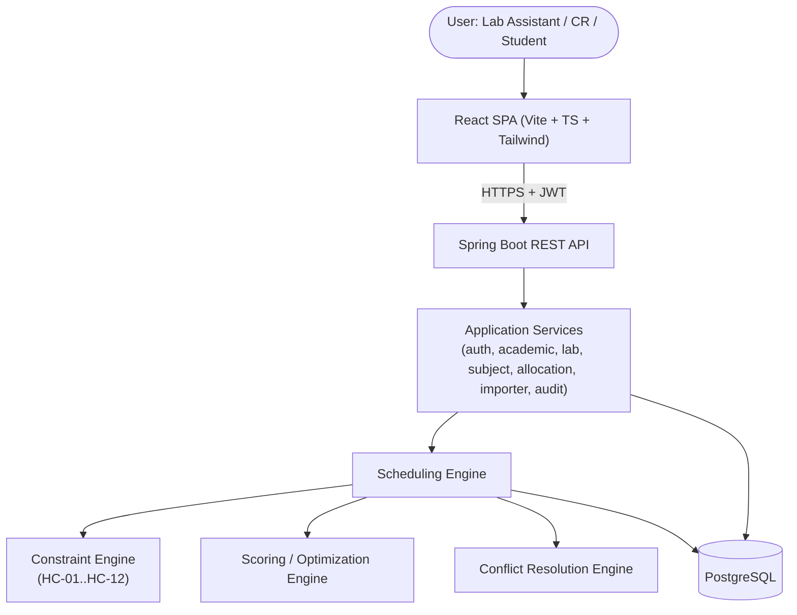

### Why React
Component-based UI maps naturally onto three structurally different dashboards (Lab Assistant / CR / Student) that share primitives (timetable grid, lab card) but differ in permitted actions. TypeScript gives compile-time safety across the many DTO shapes coming from a strongly-typed backend. Mature ecosystem (TanStack Query for server state, React Hook Form + Zod for validated forms) avoids reinventing data-fetching/caching.

### Why Spring Boot / Java
The core value of this project is a typed, testable, transactional domain — constraint validation, scoring, backtracking search — not template rendering. Spring gives us: a strong static type system for the domain model, first-class transaction management (critical for FCFS + concurrency correctness), Spring Security for layered RBAC, and a mature testing stack (JUnit 5, Mockito, Spring Boot Test, Testcontainers) that lets the scheduling engine be tested in isolation from the web/persistence layers.

### Why PostgreSQL
The domain is inherently relational: labs, faculty, batches, divisions, and allocations reference each other with strict integrity requirements (a session must reference a real lab, a real faculty, a real batch). PostgreSQL gives us foreign key integrity, ACID transactions, configurable isolation levels, and either unique constraints or advisory/row locks — all of which the concurrency-safe booking design (Phase 16) depends on directly, not incidentally.

### Why a modular monolith (not microservices)
At this scale (one college, ~15 labs, a few hundred allocations/week) a distributed system buys nothing but operational complexity: no independent scaling need, no independent deployment need, no team boundary that maps to service boundaries. A modular monolith gives the same internal separation of concerns (via Java package boundaries: `constraint`, `scoring`, `conflict`, `scheduler` are independent, testable modules) with one build, one deployment, one transaction boundary — which the FCFS/concurrency requirement actually needs (a single DB transaction spanning constraint check + insert is far simpler within one process than across service calls). See [15-DESIGN-DECISIONS.md](15-DESIGN-DECISIONS.md) for the full ADR.

### Why not MongoDB
The domain is uniformly relational — every scheduling decision depends on joining labs, faculty, batches, divisions, subjects, and time windows with strict integrity requirements (a session must reference a *real* lab that *really* has the required software). A document store would either duplicate that relational data across documents (denormalization that itself becomes an integrity risk — two copies of "does this lab have Cloudera" can drift) or push every cross-reference check into application code. More fundamentally, the core correctness requirement — no two concurrent requests can double-book the same lab/time — depends on transactional/locking guarantees that a relational database provides natively (see ADR-003, ADR-010) and that a document store would require reinventing at the application layer, reintroducing exactly the check-then-insert race condition this project is designed to eliminate (PART 34/64). There is no offsetting benefit here: the data has no genuinely schemaless part (even PDF-import raw extraction is stored as ordinary nullable columns — ADR-007 — not because Postgres can't hold semi-structured data, but because keeping it in the same relational store keeps import correction trivially joinable against the same lab/faculty/subject tables).

### Why not React → Node → Java
Inserting a Node.js layer between the React frontend and the Spring Boot backend would mean: a second server runtime to deploy, monitor, and secure; a duplicated slice of API/domain logic (either Node re-validates what Spring Boot already validates, or it becomes a dumb proxy that adds latency and a new failure point for zero behavior); and a second place authentication/authorization would need to be enforced correctly, doubling the RBAC risk surface (PART 42 requires authorization to always be enforced server-side — every additional server in the chain is another place that requirement could be gotten wrong). React talking directly to the Spring Boot REST API removes all of this for no lost capability — Vite/Node is used only as a *build-time* tool for the frontend bundle, never as a request-time server.

### Logical Architecture

```
React (Vite build, served as static assets)
      ↓ HTTPS + JWT
REST API (Spring Boot @RestController layer)
      ↓
Spring Boot modules:
  ├── auth / security     — JWT issuance, Spring Security filter chain
  ├── academic            — Program/Stream/Year/Division/Batch, CR assignment
  ├── lab                 — Lab/Software/Equipment inventory
  ├── faculty             — Faculty + availability
  ├── subject             — Subject + requirements
  ├── importer            — PDF extraction/parsing/normalization/mapping
  ├── allocation/schedule — application services orchestrating the engine
  ├── constraint          — HC-01..HC-12 (hard, gating)
  ├── scoring             — soft-factor ranking (§07-ALLOCATION-SCORING.md)
  ├── conflict            — alternative-suggestion service
  └── audit               — append-only audit log
      ↓
PostgreSQL (single database, Flyway-migrated)
```

### Deployment Architecture (planned — see [12-DEPLOYMENT-GUIDE.md](12-DEPLOYMENT-GUIDE.md) for full detail, unverified until Phase 2/26)

```
Browser
   ↓
React static frontend (served via nginx or equivalent static host)
   ↓ HTTPS
Spring Boot API (single container, embedded Tomcat)
   ↓
PostgreSQL (single container/managed instance, Flyway migrations run on backend startup)
```

Docker Compose packages all three (Postgres, backend, frontend) for local development, demo, and CI, giving one reproducible `docker compose up` command instead of per-developer manual installs — it is a developer/ops convenience here, not a scaling mechanism (there is no requirement to scale backend/frontend independently at this project's size).

## 2. Role Matrix

See [02-REQUIREMENTS.md](02-REQUIREMENTS.md#role-summary) for the capability matrix. Full endpoint-level authorization rules are documented in [09-AUTHORIZATION-RBAC.md](09-AUTHORIZATION-RBAC.md) (Phase 3).

## 3. Core Entities

Finalized in [04-DATABASE-DESIGN.md](04-DATABASE-DESIGN.md) (Phase 1, this same pass) — that document is now the single source of truth for the ER diagram and per-entity rationale, so it is not duplicated here (a duplicate diagram is a duplicate to keep in sync, and the project's own working rules call for correcting rather than accumulating inconsistency). Key entities: `app_user`, `cr_assignment`, `program`→`stream`→`academic_year`→`division`→`batch`, `subject` (+ software/equipment/lab-type requirements), `faculty` (+ availability, + `subject_faculty_assignment` scoped to division/batch/term), `lab` (+ `lab_type`, `lab_software`, `lab_equipment`, `lab_unavailability`), `academic_term`→`schedule_version`→`allocation`, `timetable_import`→`timetable_import_entry`, `audit_log`.

Key modeling decision: `ALLOCATION.target_type` is an explicit `DIVISION | BATCH` enum, enforced by both application validation and a database CHECK constraint (see [04-DATABASE-DESIGN.md §7](04-DATABASE-DESIGN.md)) — not a null-as-hack.

## 4. Scheduling Concepts

- **SchedulingRequest** — the input: subject, target (division or batch), date, time window, requester.
- **SchedulingContext** — everything the constraint/scoring engine needs to evaluate a request: existing allocations in the relevant window, faculty availability, lab inventory, subject requirements.
- **CandidateAllocation** — one (lab, faculty, time) combination under consideration.
- **ConstraintResult / ConstraintViolation** — pass/fail + reason from a single `SchedulingConstraint`.
- **ScoreBreakdown** — per-scorer contributions plus total, for a valid candidate.
- **AllocationDecision** — the final selected candidate plus full explanation (constraints passed, score breakdown, rejected alternatives with reasons).

Full detail in [05-SCHEDULING-ENGINE.md](05-SCHEDULING-ENGINE.md). **Roadmap correction (Phase 8):** this Phase-1-era paragraph originally tagged the whole scheduling-engine document "(Phase 8)" without distinguishing the persisted schema from the algorithm — a label never revisited across Phases 4–7, which is exactly the inconsistency Phase 8 corrects. The finalized numbering (§16 below) is: Phase 8 builds the `Allocation`/`ScheduleVersion` persistence layer and these domain objects' *shapes*; Phase 9 is the Constraint Engine that evaluates them; Phase 10 onward is candidate generation, scoring, explainability, alternatives, and backtracking, in that order.

## 5. Allocation Lifecycle — Two Separate State Machines, Deliberately Not One

**Design question resolved (phase brief §16):** do REGULAR and EXTRA allocations need identical lifecycles, sharing states like `DRAFT`/`PENDING_REVIEW`/`CONFLICT`/`REJECTED`? **No.** Modeling them as one shared state machine was the initial (Phase 0) draft and, on review, created exactly the kind of contradiction the Phase 1 consistency check is meant to catch: `CONFLICT` and `REJECTED` are properties of *unreviewed, not-yet-real* data (a PDF-extracted row that might be wrong), never of an `Allocation` row itself — an `Allocation` is only ever created once it is already known to be valid (either Lab-Assistant-approved from a `TimetableImportEntry`, or hard-constraint-validated in the same transaction as an EXTRA booking). Splitting the lifecycle into two purpose-built state machines removes four states that never actually applied to `Allocation` and answers every question the brief poses directly:

| Question | Answer |
|---|---|
| Does EXTRA need Lab Assistant approval? | **No.** EXTRA passes the same hard constraints (HC-01..HC-12) inside one atomic transaction and is created directly as `APPROVED`, then immediately `PUBLISHED` (see below) — approval-by-review is a REGULAR/import-only concept. |
| Can a CR's valid EXTRA booking immediately become active? | **Yes** — that's the entire point of FCFS extra-lab booking; waiting for a human or for the next scheduled publish would defeat it. |
| Can a published allocation be cancelled? | **Yes**, for `EXTRA` allocations only, by the owning CR (or by Lab Assistant for any). `REGULAR` allocations are cancelled only by the Lab Assistant (e.g. correcting a mistake before the next re-publish), never by a CR. |
| Can a rejected allocation be edited? | N/A to `Allocation` — rejection happens at the `TimetableImportEntry` stage (correctable, re-validated) before an `Allocation` row ever exists. |
| Does "conflict" exist as a persistent status? | **No** — it is always a transient validation outcome (`TimetableImportEntry.validation_status = CONFLICT`, or an API error response for a rejected EXTRA request), never written as an `Allocation.status` value. |

### `Allocation.status` (both types — deliberately small)

```mermaid
stateDiagram-v2
    [*] --> APPROVED: constraints satisfied at creation (import approval, or EXTRA transaction commit)
    APPROVED --> PUBLISHED: included in / cascades from a published ScheduleVersion
    PUBLISHED --> CANCELLED: EXTRA — owning CR (or Lab Assistant); REGULAR — Lab Assistant only
    APPROVED --> CANCELLED: cancelled before its version publishes
    PUBLISHED --> [*]
    CANCELLED --> [*]
```

- **REGULAR**: created as `APPROVED`, attached to the term's current `DRAFT` `ScheduleVersion`; becomes `PUBLISHED` only when the Lab Assistant explicitly publishes that version (cascades to every `APPROVED` allocation under it in the same transaction).
- **EXTRA**: only reaches `APPROVED`+`PUBLISHED` after the full pipeline completes, in order: (1) authorization — CR's `divisionId` resolved from their own `cr_assignment`, never trusted from the request (HC-11); (2) latest-state hard-constraint validation — HC-01..HC-12 re-checked against the database as it stands *right now*, not against a stale client-side candidate list; (3) transactional concurrency protection — the check-and-insert happens inside one transaction with the locking/exclusion mechanism from ADR-010, so a second concurrent request for the same resource cannot slip through between check and commit; (4) only once the commit actually succeeds is the row written as `APPROVED` **and immediately `PUBLISHED`** in that same transaction, attached to the term's *currently published* `ScheduleVersion` (resolves ASSUMPTIONS A-11 — extra labs do not wait for the next official version cut; they overlay the live published version as soon as they're validly booked). **At no point does an EXTRA allocation skip authorization, hard-constraint validation, or commit-time revalidation** — "immediate" describes how fast a *valid, committed* booking becomes visible, not a shortcut around the checks themselves.
- Only `APPROVED`/`PUBLISHED` rows occupy a lab/faculty/batch for future conflict checks (matches the partial indexes in [04-DATABASE-DESIGN.md §7](04-DATABASE-DESIGN.md)).
- `CANCELLED` is terminal, never deletes the row, and always records `cancelledBy`/`cancelledAt`/`cancellationReason`.

### `TimetableImportEntry.validation_status` (import-only — separate lifecycle)

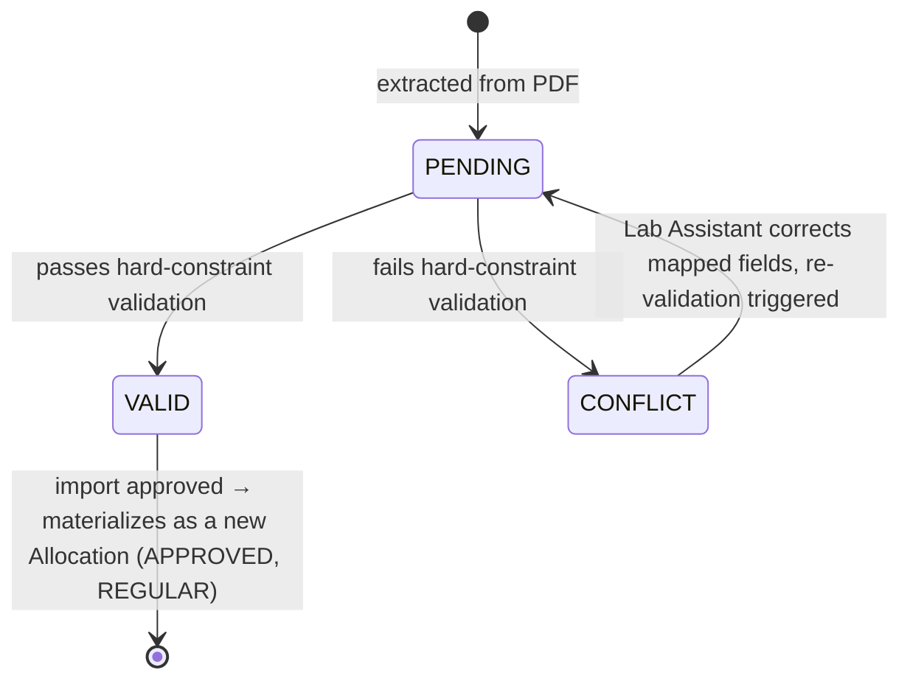

`REJECTED` at the whole-import level (`timetable_import.status`) means the Lab Assistant discarded the entire batch — individual entries are never force-approved while `CONFLICT`.

## 6. Allocation Request Flow

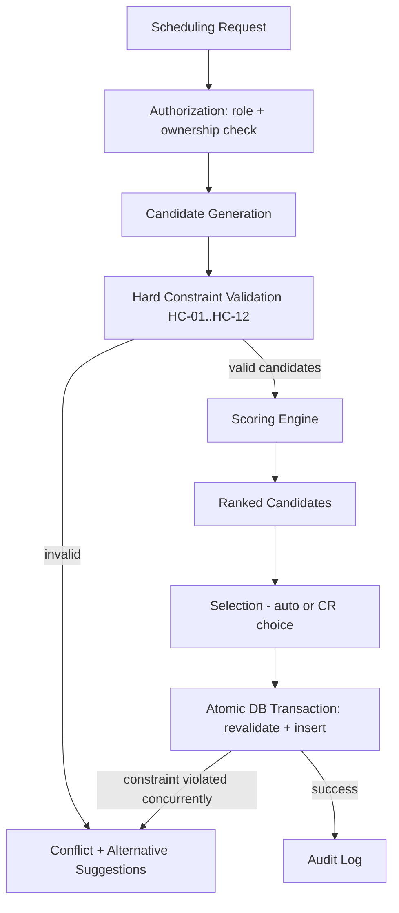

## 7. PDF Import Flow

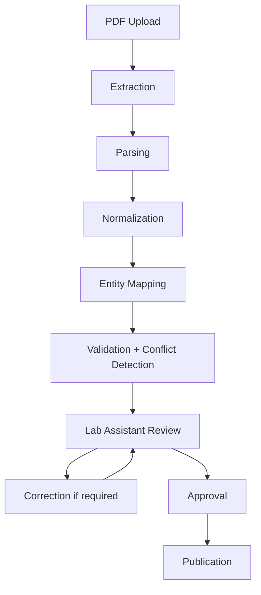

## 8. Backend Module Boundaries (Java packages)

```
auth/ user/ academic/ faculty/ lab/ subject/
schedule/ allocation/ constraint/ scoring/ conflict/
importer/ audit/ security/ common/
```

`constraint`, `scoring`, `conflict`, and the scheduler within `schedule` depend only on the domain objects in §4 (or their own package), not on JPA entities or HTTP DTOs directly — application services in `allocation`/`schedule` translate between persistence, domain, and API layers. This keeps the engine unit-testable without a database (NFR-08).

## 9. Consistency Check (Phase 1 sign-off)

- Role matrix (§2) matches FR-01..FR-29 in [02-REQUIREMENTS.md](02-REQUIREMENTS.md). ✅
- State machine (§5) matches the allocation lifecycle referenced by FR-15, FR-24, FR-25. ✅
- Entity diagram (§3) covers every entity named in the original spec's PART 39, with the documented decision *not* to blindly create a table for every name until relationships are modeled (deferred to Phase 4+ per-domain migrations). ✅
- No UI work has started; this document and its siblings are the only Phase 1 output. ✅

## 10. Phase 2 — Implemented Foundation (actual, verified state)

Everything in §§1-9 above was the Phase 1 *plan*. This section records what was actually built and verified in Phase 2 (Project Foundation) — see [12-DEPLOYMENT-GUIDE.md](12-DEPLOYMENT-GUIDE.md) and [13-DEVELOPER-SETUP.md](13-DEVELOPER-SETUP.md) for full verified command output.

### Actual repository structure

```
Lab_allocation/
├── backend/                      Spring Boot 4.1.1, Java 21, Maven (wrapper committed)
│   ├── pom.xml
│   ├── mvnw / mvnw.cmd / .mvn/
│   ├── Dockerfile                multi-stage: maven:3.9-eclipse-temurin-21 -> eclipse-temurin:21-jre-alpine
│   └── src/main/java/com/college/laballocation/
│       ├── LabAllocationBackendApplication.java
│       ├── common/                ApiErrorResponse, ApiException, ResourceNotFoundException, GlobalExceptionHandler
│       └── config/                CorsConfig
│   └── src/main/resources/
│       ├── application.yml, application-dev.yml, application-test.yml
│       └── db/migration/V1__baseline.sql
├── frontend/                      React 19 + TypeScript + Vite 8
│   ├── Dockerfile                 multi-stage: node:20-alpine -> nginx:1.27-alpine
│   ├── nginx.conf                 SPA fallback routing for React Router
│   └── src/{api,components,features,hooks,layouts,pages,routes,types}/
├── docs/
├── .github/workflows/             placeholder only - CI pipeline itself is Phase 27
├── docker-compose.yml             postgres + backend + frontend, healthchecks, named volume
├── .env.example
└── README.md
```

### Verified runtime versions (this development machine, 2026-08-21)

| Tool | Planned (Phase 1, ASSUMPTIONS A-04) | Actual, verified |
|---|---|---|
| Java | 21 | **21.0.12** (Eclipse Temurin, installed via winget mid-phase — machine had no JDK beforehand) |
| Maven | 3.9+ | **3.9.16** (resolved automatically by the committed Maven Wrapper — no system-wide Maven needed) |
| Node.js | 20 LTS (ASSUMPTIONS A-04) | **v24.14.0** — newer than planned; used as-is since it built/tested/ran the Vite/React toolchain without issue. ASSUMPTIONS A-04 is superseded by this actual verified version for local dev; Docker's frontend build stage still pins `node:20-alpine` for a reproducible container build regardless of the host machine's Node version. |
| npm | bundled | **11.9.0** |
| Spring Boot | 3.x (original Phase 0 assumption) | **4.1.1** — Spring Initializr's supported version range had moved past 3.x entirely by the time this phase ran (`start.spring.io` rejected 3.3.x as below its minimum supported range); superseding ASSUMPTIONS A-04's "Spring Boot 3.x" framing was unavoidable, not a discretionary choice. Package names changed accordingly (e.g. `spring-boot-starter-webmvc` instead of `spring-boot-starter-web`, `org.springframework.boot.resttestclient.TestRestTemplate` instead of `org.springframework.boot.test.web.client.TestRestTemplate`) - noted here so the difference from any Spring Boot 3.x tutorial/reference material is understood, not mistaken for an error. |
| Docker | recent stable | Docker Desktop 4.86.0 / Engine 29.7.2, confirmed working via CLI and Docker Compose |

### Configuration flow (actual)

`docker-compose.yml` / local shell environment variables (`DB_HOST`, `DB_PORT`, `DB_NAME`, `DB_USER`, `DB_PASSWORD`, `SERVER_PORT`, `SPRING_PROFILES_ACTIVE`, `CORS_ALLOWED_ORIGINS`) → `application.yml` placeholders (`${DB_HOST:localhost}` etc., sensible localhost defaults for bare `./mvnw spring-boot:run` without Docker) → Spring Environment → `DataSource`/`CorsConfig` beans. No credential ever has a non-placeholder default beyond a clearly-labeled local dev value (`change_me`), and `.env` is git-ignored (`.env.example` is the committed template).

### Health flow (actual)

`GET /actuator/health` (Spring Boot Actuator, `management.endpoints.web.exposure.include: health,info` only — the rest of the actuator surface is not exposed) → aggregates the built-in DB health indicator (via `spring-boot-starter-data-jpa`'s auto-configured `DataSourceHealthIndicator`) → `{"status":"UP",...}` once the datasource is reachable. Verified end-to-end in `LabAllocationBackendApplicationIT` against a real Testcontainers-launched PostgreSQL instance (not a mock).

### Deviations from the Phase 1 plan, and why

- **Spring Boot 4.1.1 instead of "3.x"** — forced by Spring Initializr's supported version window at the time of implementation (see table above); the modular-monolith / package-boundary architecture (§1, §8) is unaffected, only some artifact/class names differ from Boot 3.x conventions.
- **Testcontainers-backed integration test separated into Failsafe (`mvn verify`), not Surefire (`mvn test`)** — see ADR-014 in [15-DESIGN-DECISIONS.md](15-DESIGN-DECISIONS.md); this keeps the default build fast and Docker-independent, which turned out to matter directly in this development environment (see Known Limitations in [13-DEVELOPER-SETUP.md](13-DEVELOPER-SETUP.md)).
- Everything else (module boundaries, entity design, constraint/scoring/conflict separation, API base path, CORS approach) matches the Phase 1 plan unchanged.

## 11. Phase 3 — Authentication + RBAC (implemented)

### Authentication flow

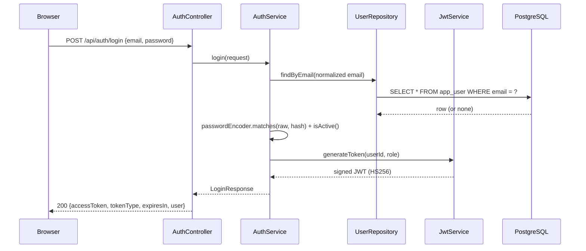

### Authenticated request flow

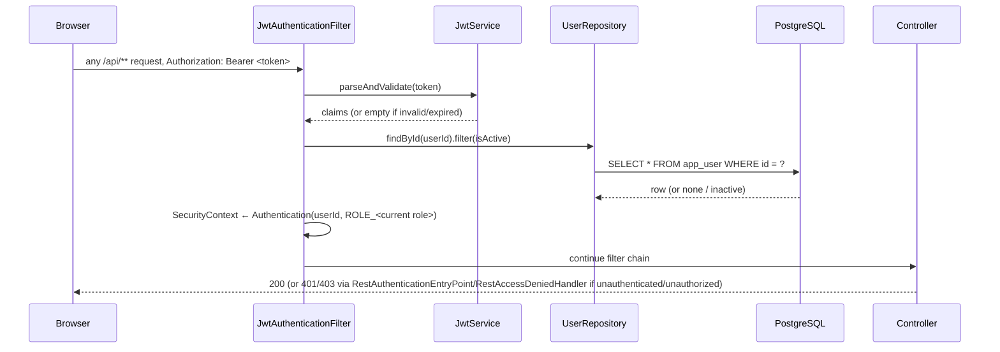

The user is **re-fetched from the database on every request** (not cached from the token) specifically so a deactivation takes effect immediately (docs/09-AUTHORIZATION-RBAC.md).

### New backend packages (Phase 3)

```
com.college.laballocation.user/       AppUser (entity), UserRole (enum), UserRepository, DevUserSeeder (@Profile("dev"))
com.college.laballocation.auth/       AuthController, AuthService, LoginRequest/LoginResponse/UserSummary (DTOs), InvalidCredentialsException
com.college.laballocation.security/   SecurityConfig, JwtService, JwtAuthenticationFilter, RestAuthenticationEntryPoint, RestAccessDeniedHandler
```

### New frontend modules (Phase 3)

```
frontend/src/api/tokenStorage.ts      localStorage-backed JWT storage (trade-off documented in-code and in ADR-015)
frontend/src/api/auth.ts              login(), fetchCurrentUser()
frontend/src/api/client.ts            updated: attaches Authorization header, routes 401s to a registered handler
frontend/src/features/auth/           AuthContext/useAuth, LoginPage, ProtectedRoute, RequireRole
```

### Verified end-to-end (Dockerized, 2026-08-21/22)

Login for all three demo roles, `GET /api/auth/me` returning the correct role for each, `401` for no/invalid token, `401 INVALID_CREDENTIALS` for wrong password/unknown email/deactivated account, CORS preflight correctly scoped to `http://localhost:5173`, Flyway `V2__create_app_user.sql` applied, and the three demo users present in `app_user` inside the running Postgres container. Full command-by-command detail in docs/13-DEVELOPER-SETUP.md.

## 12. Phase 4 — Academic Domain (implemented)

### Academic-domain request flow (Program/Stream/AcademicYear/AcademicTerm/Division/Batch/Subject/Faculty)

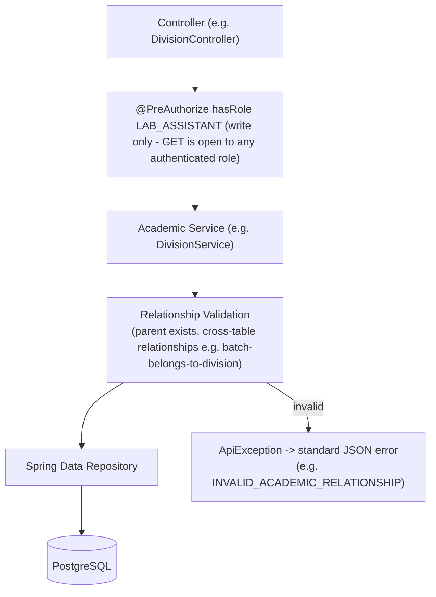

Every create/update path resolves its parent entity through the corresponding service's `getEntity(id)` (throws a specific `*_NOT_FOUND` code if missing) before touching the repository — foreign keys catch a nonexistent id, but not a *wrong* one (e.g. a real batch that belongs to a different division), which is why explicit relationship validation exists as its own step, not folded into persistence.

### CR ownership resolution flow

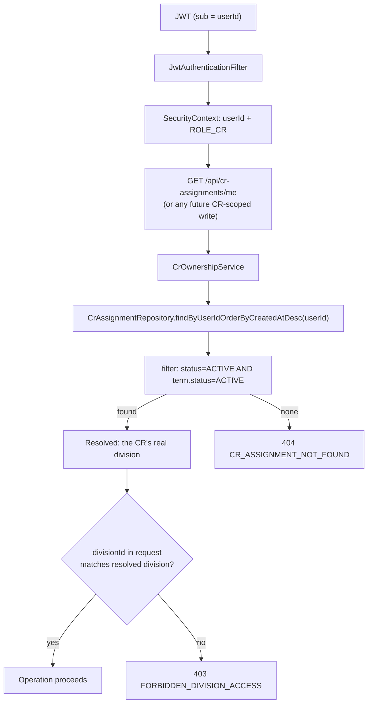

The client-supplied `divisionId` (where one exists in a future request body) is never trusted as authorization — only ever cross-checked against the value resolved purely from the authenticated `userId`. See docs/09-AUTHORIZATION-RBAC.md for the full role-vs-ownership distinction and the worked CR-A/Division-B example.

### New backend packages (Phase 4)

```
com.college.laballocation.academic/   Program, Stream, AcademicYear, AcademicTerm, Division, Batch,
                                       CrAssignment, their repositories/services/controllers/DTOs,
                                       CrOwnershipService, DevAcademicSeeder (@Profile("dev"))
com.college.laballocation.subject/    Subject + repository/service/controller/DTOs
com.college.laballocation.faculty/    Faculty, SubjectFacultyAssignment, FacultyAssignmentResolutionService,
                                       their repositories/services/controllers/DTOs
```

### Deviations from the Phase 1 plan, and why

- **`division.strength`/`batch.strength` are `NOT NULL`, not nullable** as an earlier draft had `division.strength` — both target types (BATCH/DIVISION) need a real capacity number for HC-07, so leaving one nullable would just defer a null-check to the constraint engine later. Corrected now rather than migrated later.
- **API paths are flat resource nouns** (`/api/programs`, `/api/divisions`, ...), not nested under `/api/academic/...` as the Phase 1 sketch in docs/10-API-DOCUMENTATION.md loosely suggested — simpler routing, consistent with the rest of the API surface, and updated in that document to match.
- Everything else (entity relationships, no-`SubjectOffering` decision, CR assignment history model, capacity source of truth) matches the Phase 1 plan unchanged.

## 13. Phase 5 — Laboratory Domain (implemented)

### Lab management flow

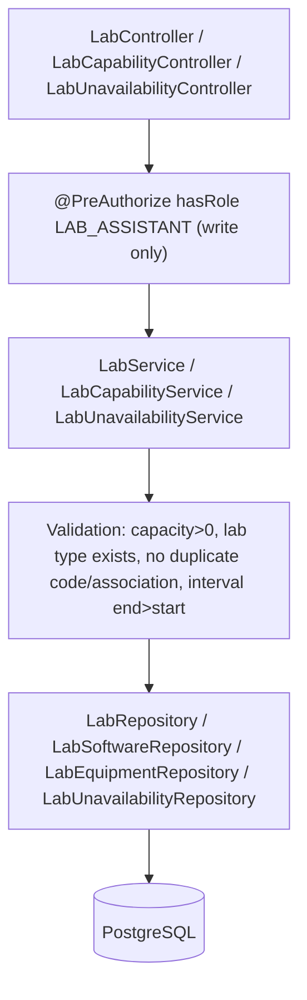

### Static capability filtering (not scheduling)

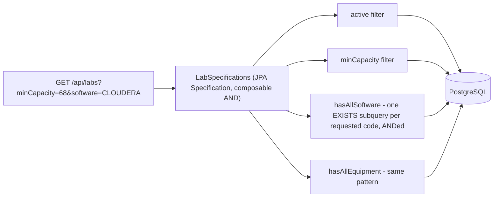

**How the future scheduling engine will consume, but not own, this data:** Phase 9+'s constraint engine (HC-06/07/08/09/10) will *read* `lab`, `lab_type`, `lab_software`, `lab_equipment`, and `lab_unavailability` as inputs to candidate generation and hard-constraint validation — but it will never write to them. Lab master data ownership stays entirely with the Lab Assistant via this phase's API; the scheduling engine is a consumer, not a co-owner, of the laboratory domain (mirroring how it will later read, not own, the academic domain from Phase 4).

### New backend package (Phase 5)

```
com.college.laballocation.lab/   LabType, Lab, Software, Equipment, LabSoftware, LabEquipment, LabUnavailability,
                                  their repositories/services/controllers/DTOs, LabSpecifications (static capability
                                  filtering), DevLabSeeder (@Profile("dev"))
```

### Verified end-to-end (Dockerized, 2026-08-22)

15 seeded labs across wings B/C/D (5/5/5), capacities 30–80, 3 of 15 with Cloudera (2 satisfying capacity ≥ 68, 1 smaller); RBAC (LAB_ASSISTANT create allowed, CR/STUDENT 403, unauthenticated 401); invalid capacity and duplicate-code rejected cleanly; Cloudera filter, capacity filter, and their AND-combination all verified against real seeded data; unavailability `end <= start` rejected; all DB constraints (capacity CHECK, interval CHECK, association uniqueness) confirmed directly in the schema; seed idempotency confirmed by restarting the backend container and re-checking row counts. Full detail in docs/13-DEVELOPER-SETUP.md.

### Deviations from the Phase 1 plan

- **`lab_unavailability` uses full `TIMESTAMPTZ` granularity**, not the date-level granularity this document's Phase 1 draft originally sketched as "sufficient" — superseded per the Phase 5 brief's explicit instruction to use proper temporal types with clear interval semantics (docs/04-DATABASE-DESIGN.md).
- Everything else (configurable `LabType`/`Software`/`Equipment` instead of enums, explicit `LabSoftware`/`LabEquipment` association entities, flat location model) matches the Phase 1 plan.

## 14. Phase 6 — Subject Requirements (implemented)

### Requirement management flow

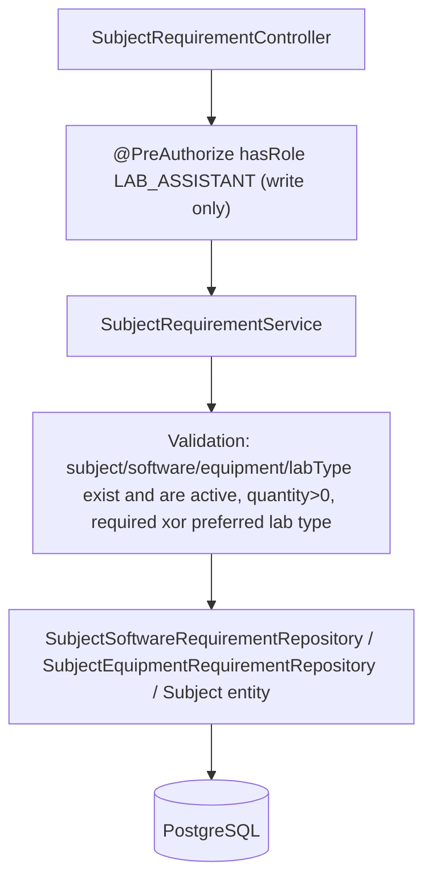

### The two-sided model, staged deliberately (the project's core "not-CRUD" story)

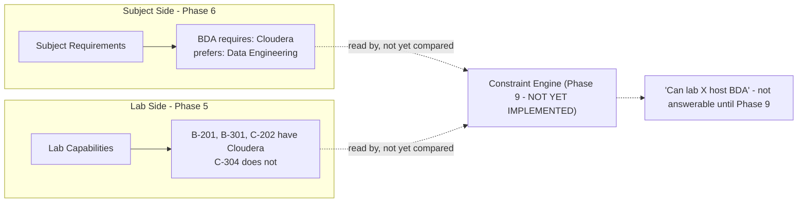

Phase 6 never writes to `lab_software`/`lab_equipment`/`lab.lab_type_id` (Phase 5's tables); Phase 5 never writes to `subject_software_requirement`/`subject_equipment_requirement`/`subject.required_lab_type_id` (Phase 6's columns). Each phase's manual Docker verification deliberately queried *both* sides independently (`GET /api/subjects/{id}/requirements` and `GET /api/labs?software=CLOUDERA` as two separate, uncombined facts) specifically to keep this separation honest, not just documented.

**Update (Phase 9):** the diagram above reflects this section's original Phase 6 state. `RequiredSoftwareConstraint`/`RequiredEquipmentConstraint`/`RequiredLabTypeConstraint` now exist and do the comparison this diagram calls "not yet compared" — see §17 below and docs/06-CONSTRAINTS.md HC-08/09/10.

### New backend additions (Phase 6)

```
com.college.laballocation.subject/   + SubjectSoftwareRequirement, SubjectEquipmentRequirement (entities),
                                        their repositories, SubjectRequirementService, SubjectRequirementController,
                                        SubjectRequirementDtos, DevSubjectRequirementSeeder (@Profile("dev"))
                                      Subject (Phase 4 entity) + required/preferred lab-type fields and
                                        setLabTypeRequirement() validation
```

### Verified end-to-end (Dockerized, 2026-08-22)

BDA's requirements (`Cloudera`, preferred `DATA_ENGINEERING`, no required type) retrieved via the real endpoint and cross-referenced against Phase 5's independently-verified Cloudera-capable lab list; CNS confirmed to have zero requirements of any kind (empty lists, both lab-type fields null) with no error; RBAC (LAB_ASSISTANT allowed, CR/STUDENT 403, unauthenticated read 401); duplicate software requirement rejected as `409 SOFTWARE_REQUIREMENT_ALREADY_EXISTS`; equipment `requiredQuantity=0` rejected, `=5` accepted; a newly-deactivated software correctly rejected as a new requirement (`INACTIVE_SOFTWARE`); both/neither lab-type-preference validation proven at the unit level; all DB constraints (`chk_ser_quantity_positive`, `chk_subject_lab_type_pref`, uniqueness) confirmed directly in the schema; seed idempotency confirmed by restarting the backend container (BDA→Cloudera remained exactly one row); Phase 5's lab/software/equipment counts confirmed unchanged. Full detail in docs/13-DEVELOPER-SETUP.md.

### Deviations from the Phase 1 plan

None of substance — the required-vs-preferred lab-type distinction, subject-level (not per-term) requirement scope, and ALL-required software/equipment semantics all match what Phase 1's design already anticipated.

## 15. Phase 7 — Faculty Availability (implemented)

### Availability management + evaluation flow

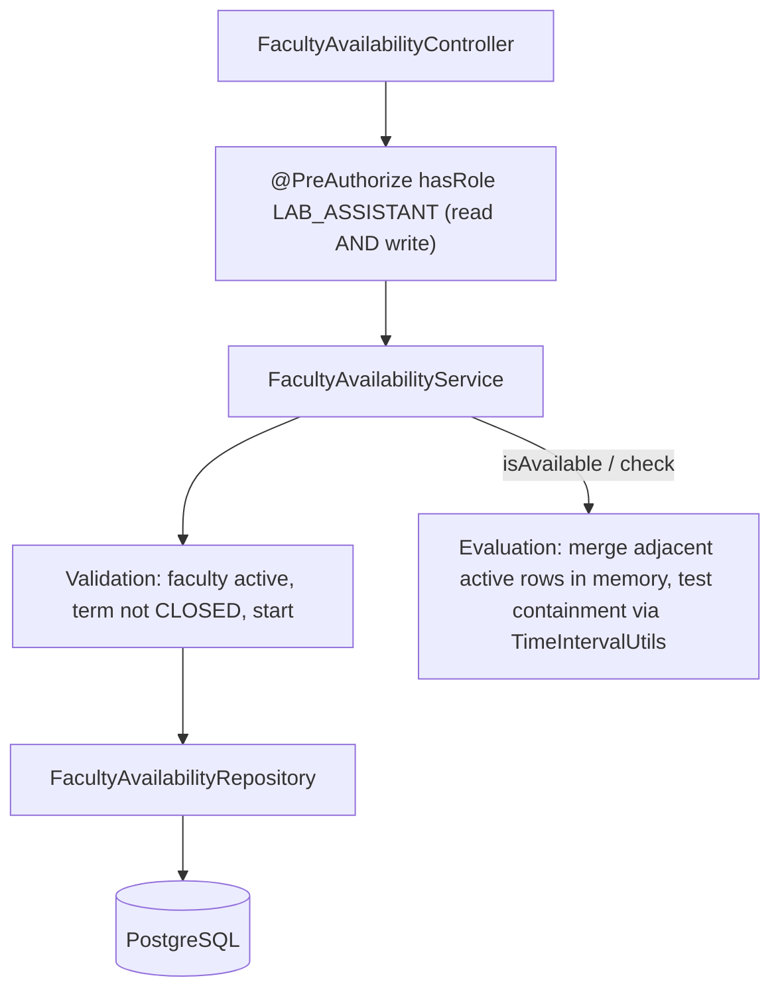

### Faculty Availability vs. Faculty Conflict — two layers, never confused (PART 41 of the phase brief)

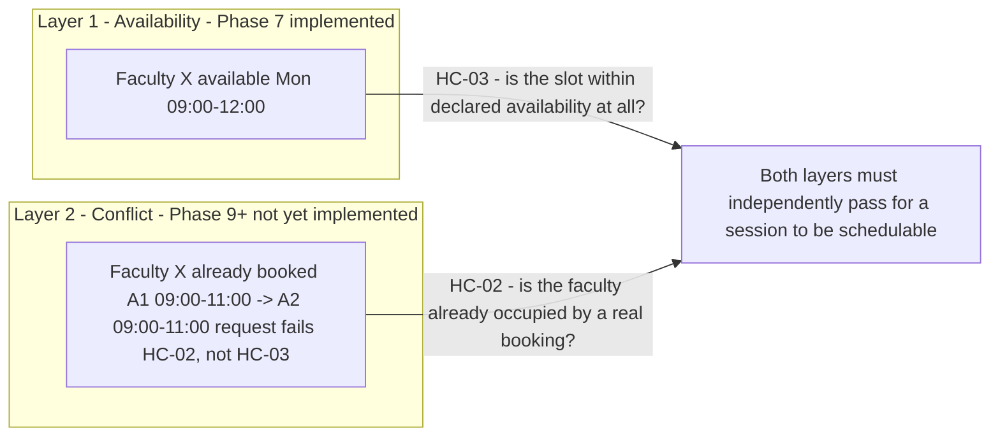

A faculty can be generally *available* (HC-03) at a time they are already *booked* (HC-02) — availability is a static weekly boundary the faculty declares in advance; conflict depends on real allocation data. Phase 7 implemented the availability layer's data and evaluation logic; Phase 9 (§17 below) implemented both `FacultyAvailabilityConstraint` and `FacultyConflictConstraint` as real, independently-tested `SchedulingConstraint` classes, verified with a dedicated test proving they can disagree for the identical candidate (available but conflicted).

### New backend additions (Phase 7)

```
com.college.laballocation.common/    + TimeIntervalUtils (isValid/overlaps/contains, half-open [start,end)
                                        semantics reused by faculty availability now, future constraints later)
com.college.laballocation.faculty/   + FacultyAvailability (entity), FacultyAvailabilityRepository,
                                        FacultyAvailabilityService, FacultyAvailabilityController,
                                        FacultyAvailabilityDtos, DevFacultyAvailabilitySeeder (@Profile("dev"))
```

### Access model — deliberately narrower than Phase 5/6 (PART 22 of the phase brief)

Unlike Labs/Subjects (Phase 5/6), where `GET` is open to any authenticated role, `/api/faculty/{id}/availability*` restricts **both** read and write to `LAB_ASSISTANT`. Raw faculty-availability management data has no legitimate CR/STUDENT consumer yet — the future constraint engine (Phase 9+) will call `FacultyAvailabilityService` internally, not through this REST surface, so there is no student- or CR-facing use case this phase needs to support. See docs/09-AUTHORIZATION-RBAC.md's Permission Matrix (updated this phase) and ADR-034.

### Verified end-to-end (Dockerized, 2026-08-22)

All 8 of the phase brief's required scenarios (A-H: LAB_ASSISTANT creates valid availability, CR/STUDENT mutation both 403, unauthenticated read 401, overlapping create rejected `409 FACULTY_AVAILABILITY_OVERLAP`, adjacent create allowed, BDA-Monday-09:00-11:00 check returns available, BDA-Monday-13:00-14:00 check returns unavailable) executed with real `curl` requests against the running containers; PATCH and DELETE (soft-deactivate) verified directly; a restart-and-recount idempotency check confirmed the seeded+test-created row count (7) was unchanged across a backend container restart; Phase 4-6 regression endpoints (`/api/auth/me`, `/api/cr-assignments/me`, Cloudera lab filter, BDA subject requirements) re-verified working with no regression.

### Deviations from the Phase 1 plan

**`academic_term_id` made mandatory**, not nullable — the Phase 1 draft's "applies every term" design (docs/ASSUMPTIONS.md A-15) is superseded per the Phase 7 brief's explicit recommendation; see ADR-031. Read access restricted to `LAB_ASSISTANT` only (see above) is also a deliberate narrowing versus the open-read pattern of Phase 5/6, not an oversight — documented, not silent.

## 16. Phase 8 — Scheduling Domain & Allocation Persistence Foundation (implemented)

### Roadmap correction — finalized Phase 8–16 sequence

The single stale "(Phase 8)" tag on §4 above (pointing at the whole Scheduling Engine document, unrevised since Phase 1) is superseded by this explicit sequence, confirmed against the project's original phase brief:

| Phase | Scope |
|---|---|
| **8** | **Scheduling Domain & Allocation Persistence Foundation** (this phase) — `Allocation`/`ScheduleVersion` tables, the pure `SchedulingRequest`/`SchedulingContext`/`CandidateAllocation`/`ConstraintResult`/`ConstraintViolation` object shapes, and the repository/query infrastructure Phase 9 needs. No constraint evaluation. |
| 9 | Constraint Engine — the actual `SchedulingConstraint` classes (HC-01..HC-12) that read this phase's persisted data and evaluate a candidate. |
| 10 | Candidate Generation — querying/filtering labs into a candidate list for a request. |
| 11 | Scoring Engine — ranking valid candidates (docs/07-ALLOCATION-SCORING.md). |
| 12 | Explainable Allocation — `AllocationDecision`, the final selected-candidate-plus-explanation result type (deliberately deferred past Phase 8, see §17.7 below). |
| 13 | Conflict Detection + Alternatives — ranked fallback suggestions when a request fails. |
| 14 | Automatic Scheduling / Backtracking — most-constrained-first multi-session generation. |
| 15 | Extra Lab Scheduling — the CR-facing FCFS booking flow that finally creates real `Allocation` rows in production. |
| 16 | FCFS / Concurrency — finalizes ADR-010's provisional concurrency mechanism. |

This is a documentation correction, not a change to any business requirement — every FR/HC this project has already documented (docs/02-REQUIREMENTS.md, docs/06-CONSTRAINTS.md) is unaffected; only the phase *numbering* for not-yet-built algorithm work is being made internally consistent (11-TESTING-STRATEGY.md's "Algorithm Test Coverage" section header is corrected to match, see that document).

### Persisted state vs. transient algorithm objects

```mermaid
flowchart TD
    subgraph Persisted - Phase 8 implemented
        SV[ScheduleVersion] --> AL[Allocation]
    end
    subgraph Transient domain objects - Phase 8 shapes only, Phase 9+ populates/evaluates them
        SR[SchedulingRequest] --> SC[SchedulingContext]
        SC --> CA[CandidateAllocation]
    end
    AL -.->|"read by SchedulingContextFactory"| SC
    CA -.->|"evaluated by"| CE["Phase 9 Constraint Engine - NOT YET IMPLEMENTED"]
    CE -.-> CR[ConstraintResult / ConstraintViolation]
```

`ScheduleVersion`/`Allocation` are real, migrated JPA entities (`V10__create_schedule_version_and_allocation.sql`). `SchedulingRequest`, `SchedulingContext`, `CandidateAllocation`, `ConstraintResult`, `ConstraintViolation` are plain Java records with no JPA annotations at all (NFR-08) — see docs/05-SCHEDULING-ENGINE.md for the full per-object contract Phase 9 will implement against.

### New backend additions (Phase 8)

```
com.college.laballocation.scheduling/  + AllocationType, TargetType, AllocationStatus, ScheduleVersionStatus (enums)
                                          ScheduleVersion (entity), ScheduleVersionRepository, ScheduleVersionService
                                          Allocation (entity, static forBatch/forDivision factories), AllocationRepository,
                                          AllocationQueryService (read-only, no creation methods)
                                          SchedulingTimeMapper, InstantRange (LocalDate/LocalTime <-> Instant bridge)
                                          SchedulingRequest, SchedulingContext, SchedulingRefs, CandidateAllocation,
                                          ConstraintResult, ConstraintViolation, HardConstraintId (pure domain objects)
                                          SchedulingContextFactory (assembles a context from existing Phase 4/5 services)
                                          DevScheduleVersionSeeder (@Profile("dev") - seeds ScheduleVersion only, no Allocation rows)
```

### No production Allocation-creation API (deliberate, PART 31 of the phase brief)

Neither `POST /api/allocations` nor any `AllocationController` exists. A raw `Allocation` row must never bypass the constraint engine that doesn't exist until Phase 9 — verified live: `POST /api/allocations` and `GET /api/allocations` both return `404` against the running stack, confirming no such surface was accidentally exposed. `Allocation` rows in this phase are only ever created via direct repository calls from tests and the dev seeder — never through a REST boundary.

### Verified end-to-end (Dockerized, 2026-08-22)

Flyway migrated to v10 cleanly; `DevScheduleVersionSeeder` created one `PUBLISHED` `ScheduleVersion` (term "Semester 5 (2026-27)", version 1) with zero `Allocation` rows, confirmed via direct `psql` query. Five DB-level guarantees proven with real, transactional `psql` inserts against the live container: (1) a valid DIVISION-targeted allocation insert succeeds; (2) a BATCH-targeted insert with a null `batch_id` is rejected by `chk_allocation_target_invariant`; (3) `end_time <= start_time` is rejected by `chk_allocation_interval`; (4) a duplicate `(academic_term_id, version_number)` is rejected by `uq_schedule_version_term_number`; (5) a second `PUBLISHED` version for the same term is rejected by `uq_schedule_version_one_published_per_term`. A restart-and-recount idempotency check confirmed the seeded `schedule_version` row count (1) was unchanged across a backend container restart. Phase 3-7 regression endpoints (`/api/auth/me`, `/api/cr-assignments/me`, Cloudera lab filter, BDA subject requirements, faculty availability) all re-verified working with no regression.

### Deviations from the Phase 1 plan

None of substance to the schema itself — `Allocation`/`ScheduleVersion`'s fields, invariants, and lifecycle match what docs/04-DATABASE-DESIGN.md §7 and ADR-005/ADR-009 already specified. The one real addition beyond the Phase 1 draft is the college-timezone bridge (`SchedulingTimeMapper`, `app.college.time-zone`) — the Phase 1 plan never anticipated the `LocalDate`/`LocalTime` (Allocation) vs. `TIMESTAMPTZ`/`Instant` (LabUnavailability, Phase 5) type boundary that HC-06 needed to cross; resolving it in Phase 8 (rather than leaving every future constraint to solve it independently) is a deliberate, documented addition — see ADR-037.

## 17. Phase 9 — Constraint Engine (implemented)

### Pipeline

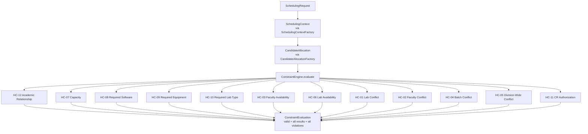

All twelve constraints run for every candidate (no fail-fast) - see docs/06-CONSTRAINTS.md for each HC's class, logic, and error code, and docs/05-SCHEDULING-ENGINE.md for the engine's own architecture notes (context reuse, applicability, deterministic ordering).

### New backend additions (Phase 9)

```
com.college.laballocation.scheduling/     + ConstraintOutcome (enum: PASS/FAIL/NOT_APPLICABLE)
                                             ConstraintResult, CandidateAllocation, SchedulingRequest, SchedulingRefs
                                               (all extended - see docs/05-SCHEDULING-ENGINE.md)
                                             SchedulingActor (userId + UserRole, nullable on SchedulingRequest)
                                             CandidateAllocationFactory (builds one candidate's LabRef snapshot)
com.college.laballocation.scheduling.constraint/   SchedulingConstraint (interface)
                                                    ConstraintEngine, ConstraintEvaluation
                                                    LabConflictConstraint, FacultyConflictConstraint,
                                                      FacultyAvailabilityConstraint, BatchConflictConstraint,
                                                      DivisionWideConflictConstraint, LabAvailabilityConstraint,
                                                      CapacityConstraint, RequiredSoftwareConstraint,
                                                      RequiredEquipmentConstraint, RequiredLabTypeConstraint,
                                                      CrAuthorizationConstraint, AcademicRelationshipConstraint
com.college.laballocation.common/         TimeIntervalUtils gained an Instant overload of overlaps(...)
```

No new migration - Phase 9 is entirely code against the Phase 8 schema, confirmed live: Flyway remained at schema version 10 after this phase's work.

### No production Allocation-creation API (still, PART 31/65 of the phase brief)

Still true after Phase 9: `POST /api/allocations` and `GET /api/allocations` both return `404`. A temporary, `@Profile("dev")`-only `ApplicationRunner` (`DevConstraintEngineVerificationRunner`) was used to exercise the real, Spring-assembled `ConstraintEngine` against real dev-seeded data over the live Docker/Postgres stack for manual verification (Testcontainers remains environment-blocked here) - it created and cleaned up its own temporary rows (a test `Allocation`, a `LabUnavailability`, a `SubjectEquipmentRequirement`, and a temporary required-lab-type flip on BDA, all reverted/deleted within the same run) and was deleted from the codebase once verification was recorded, per the phase brief's explicit instruction not to leave a diagnostic harness behind.

### A real bug found and fixed: exception-across-transaction-boundary in HC-11

The first `CrAuthorizationConstraint` called `CrOwnershipService.requireOwnsDivision(...)` and caught its thrown `ApiException` subtypes to build a `FAIL` `ConstraintResult` - consistent-looking with "represent expected failure as a result, not an exception" until manual Docker verification actually exercised the unauthorized-CR scenario and the whole request failed with `UnexpectedRollbackException`. Root cause: `requireOwnsDivision` is itself `@Transactional`: Spring's transaction interceptor marks the *shared* surrounding transaction rollback-only the moment the exception crosses that method's boundary - before this constraint's own catch block ever runs. Catching the exception in Java code did not undo the transactional marker. Fix: switched to `CrOwnershipService.getCurrentAssignment(userId)` (`Optional`-returning, never throws) and compared the division directly - no exception crosses any `@Transactional` boundary for this expected-failure path at all now. See docs/14-INTERVIEW-PREPARATION.md and docs/06-CONSTRAINTS.md HC-11 for the full account, and docs/15-DESIGN-DECISIONS.md for the resulting ADR.

### Verified end-to-end (Dockerized, 2026-08-23)

All sixteen of the phase brief's required manual scenarios executed against the real Spring-assembled `ConstraintEngine` over live Docker/Postgres using the real seeded demo data (BDA/CNS, Faculty BDA/CNS, labs B-301/C-202/C-304/B-201/C-101, Cloudera): valid A1/A2 simultaneous batches (zero violations); same-lab, same-faculty, same-batch, and division-wide conflicts each correctly rejected; faculty-unavailable and lab-temporarily-unavailable each correctly rejected; BDA/Cloudera pass vs. BDA/no-Cloudera fail; equipment-quantity pass/fail; required-lab-type pass/fail plus the mandatory preferred-only-never-fails-HC-10 check (isolated at the per-constraint result level, since the chosen demo lab also lacked Cloudera for an unrelated reason); invalid academic relationship rejected; unauthorized CR context rejected (`CR_ASSIGNMENT_NOT_FOUND`); and a multi-failure candidate returned two simultaneous violations together (software + faculty availability), proving the engine does not fail fast. All sixteen scenarios' actual results matched their expected validity. Confirmed via `psql` after the run that every temporary row the verification harness created was cleaned up (zero leftover allocations, unavailability rows, or equipment requirements). Regression re-verified: `/api/auth/me`, `/api/programs`, `/api/labs`, `/api/subjects/{id}/requirements`, `/api/faculty/{id}/availability` all still 200; `/api/allocations` still 404 both before and after.

### Deviations from the Phase 1 plan

None to the constraint *rules* themselves - every HC-01..HC-12 implementation matches docs/06-CONSTRAINTS.md's Phase 1-through-6 specification exactly. Two real, deliberate additions beyond the original plan, both because manual Docker verification surfaced a genuine need: `ConstraintOutcome`'s three-way PASS/FAIL/NOT_APPLICABLE split (Phase 1 never anticipated a constraint being inapplicable rather than satisfied) and the `CrOwnershipService.getCurrentAssignment`-over-`requireOwnsDivision` fix described above (an implementation detail invisible to the constraint *specification*, but a real architectural lesson about exceptions and Spring transaction boundaries).

## 18. Phase 10 — Candidate Generation (implemented)

### Pipeline

```mermaid
flowchart TD
    Req[SchedulingRequest] --> CtxF[SchedulingContextFactory.build - once per request]
    CtxF --> Ctx[SchedulingContext]
    Ctx --> Gen[CandidateGenerator]
    Gen -->|every lab, code ascending| CandF[CandidateAllocationFactory.build - once per lab]
    CandF --> Cand[CandidateAllocation]
    Cand --> CE[ConstraintEngine.evaluate - once per lab]
    CE --> EC[EvaluatedCandidate]
    EC --> Result[CandidateGenerationResult: all evaluated, valid() and invalid() views]
```

`CandidateGenerator` is the layer between Phase 8's `SchedulingContextFactory`/`CandidateAllocationFactory` and Phase 9's `ConstraintEngine` - it answers "which labs should be considered?" as a deliberately separate question from Phase 9's "is a considered lab valid?" and Phase 11's future "which valid lab is preferable?". See docs/05-SCHEDULING-ENGINE.md for the full architecture notes (all-labs-considered, no first-fit, invalid-candidate preservation, context-reuse, query strategy).

### New backend additions (Phase 10)

```
com.college.laballocation.scheduling.generation/   CandidateGenerator (@Service)
                                                     EvaluatedCandidate (candidate + ConstraintEvaluation)
                                                     CandidateGenerationResult (all/valid()/invalid() views)
```

No new migration - Phase 10 is entirely code against the existing Phase 8/9 schema and services, confirmed live: Flyway remained at schema version 10 after this phase's work.

### No production candidate-search API (still, PART 62 of the phase brief)

`CandidateGenerator` remains internal - no `POST /api/allocations/search` or equivalent was added. Phase 15 (CR-facing extra-lab search) is where a real endpoint around this capability belongs, once authorization, request shaping, and response formatting for an end user are actually being designed together; adding one now would be speculative surface area.

### Verified end-to-end (Dockerized, 2026-08-23)

A temporary, `@Profile("dev")`-only `ApplicationRunner` (`DevCandidateGenerationVerificationRunner`, deleted after use, same safe pattern as Phase 9's) exercised the real `CandidateGenerator` against the real dev-seeded demo data over live Docker/Postgres. All required scenarios passed: basic generation produced exactly one candidate per lab in the system (16/16, no first-fit); BDA's non-Cloudera lab (C-304) was generated and specifically rejected with `SOFTWARE_MISMATCH`; a BATCH-targeted request correctly compared candidate capacity against the *batch's* strength (not the division's - a real distinction HC-07 already made in Phase 9, confirmed here at the generation layer) and a DIVISION-targeted request against the *division's* strength on the same lab; an existing `Allocation` temporarily placed on an otherwise-valid lab flipped it to invalid (`LAB_CONFLICT`) on regeneration, then cleanup restored it to valid; a temporary `LabUnavailability` window produced `LAB_UNAVAILABLE` on regeneration, then cleanup restored validity; temporarily inflating a batch's required strength drove every lab invalid at once, and generation still completed normally with an empty valid list rather than throwing; and the A1/A2 scenario held at the generation layer - a real, persisted A1 allocation did not eliminate A2's own candidate set (15 of 16 labs remained valid, the one exception being A1's own occupied lab). Confirmed via `psql` after the run that every temporary row/mutation was cleaned up and reverted (zero leftover allocations/unavailability rows, division and batch strengths restored to seeded values). Regression re-verified: all Phase 3-9 endpoints still 200; `/api/allocations` still 404; Flyway still at schema version 10.

### Deviations from the Phase 1 plan

One real correction, not to Phase 10 itself but to an assumption baked into the Phase 1 sketch of the validation pipeline (docs/05-SCHEDULING-ENGINE.md): the original "Generate Candidate Labs" pipeline step described prefiltering by capacity/software/type before constraint validation. Phase 10 deliberately implements the opposite - generate from every lab, let `ConstraintEngine` be the sole authority on validity - specifically to avoid a second, parallel filtering path that could silently disagree with Phase 9, and to keep every rejection explainable (a prefiltered-out lab never becomes a candidate, so it would have no attached `ConstraintViolation` for Phase 12/13 to read later). See ADR in docs/15-DESIGN-DECISIONS.md.

### Pre-Phase 11 correction: the "16-lab" figure in Phase 10's original report

Phase 10's completion report observed a 16-lab system. Phase 11's mandatory pre-phase investigation (its brief's PART 2) traced this to a manually-created `E-101` lab row, persisted in the Docker named volume from an earlier manual-verification session and never cleaned up (Docker volumes survive `docker compose down`/`up` cycles unless `-v` is passed) - not a defect in `DevLabSeeder`, which was already fully idempotent and seeds exactly the documented 15 labs. The stray row was deleted (`DELETE FROM lab WHERE code='E-101'`, verified zero dependent `allocation`/`lab_software`/`lab_equipment`/`lab_unavailability` rows first) and the dev-seeded lab count is now confirmed 15 both via direct SQL and via `GET /api/labs`.

## 19. Phase 11 — Scoring Engine (implemented)

### Pipeline

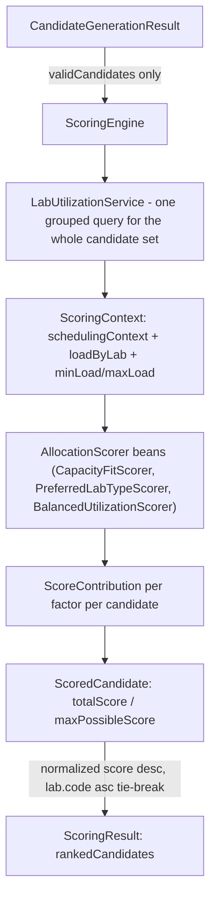

`ScoringEngine` sits directly after Phase 10's `CandidateGenerator` and reads only `CandidateGenerationResult.validCandidates()` - an invalid candidate is structurally unreachable by any scorer. See docs/05-SCHEDULING-ENGINE.md and docs/07-ALLOCATION-SCORING.md for the full architecture, readiness analysis, and formulas.

### New backend additions (Phase 11)

```
com.college.laballocation.scheduling.scoring/   ScoringEngine (@Service)
                                                  AllocationScorer (interface)
                                                  CapacityFitScorer / PreferredLabTypeScorer / BalancedUtilizationScorer (@Component)
                                                  ScoringConfiguration (@Component, app.scoring.* weights)
                                                  ScoringContext / ScoreContribution / ScoredCandidate / ScoringResult
                                                  ScoreApplicability / ScoringFactorId
com.college.laballocation.scheduling/           LabUtilizationService (@Service) - new
                                                  SchedulingRefs.SubjectRef gained preferredLabTypeId (Phase 11)
                                                  AllocationRepository gained sumScheduledMinutesByLab (Phase 11)
```

No new migration - Phase 11 is entirely code against the existing Phase 8/9/10 schema and services, confirmed live: Flyway remained at schema version 10 after this phase's work.

### No production scoring/ranking API (still)

`ScoringEngine` remains internal, same as `CandidateGenerator` - no `POST /api/allocations/search` or equivalent was added. Phase 15 is still where a real end-user-facing endpoint belongs.

### Verified end-to-end (Dockerized, 2026-08-23)

A temporary `@Profile("dev")`-only `ApplicationRunner` (`DevScoringVerificationRunner`, deleted after use, same safe pattern as Phase 9/10's) exercised the real `ScoringEngine` against the real dev-seeded BDA/CNS demo data over live Docker/Postgres. All required scenarios matched: the BDA ranking scenario (batch A1, required capacity 23) produced C-202 (Data-Engineering-typed, Cloudera-capable) ranked first over B-201/B-301 (Computer-typed, also Cloudera-capable) - preferred-lab-type credit outweighing a looser capacity fit, a real soft-factor interaction, not hardcoded; C-304 (no Cloudera, but otherwise a strong soft-score candidate - Data-Engineering type, decent capacity) was confirmed invalid and never appeared in the ranking, proving hard constraints override soft scoring; temporarily inflating batch A1's strength drove every candidate invalid and produced an empty ranking with zero valid count, not an exception; the same request scored twice produced an identical ranking (determinism); CNS (a subject with zero preferences at all) against B-202/D-202 (identical capacity 60, identical Computer type) produced an exact score tie, broken deterministically by lab code ascending (B-202 before D-202); and temporarily loading D-202 with five extra sessions on other dates dropped its Balanced Utilization score below B-202's (idle), confirmed reverted afterward via `psql` (zero leftover allocations, batch A1 strength restored to 23). Regression re-verified: all Phase 3-10 endpoints still 200; `/api/allocations` still 404 both directions; Flyway still at schema version 10; dev-seeded lab count confirmed 15.

## 20. Phase 12 — Explainable Allocation (implemented)

### Pipeline

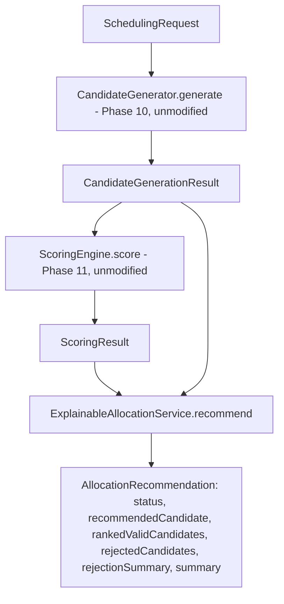

`ExplainableAllocationService` is the first orchestration layer combining Phase 10 and Phase 11 - it calls each exactly once and transforms their already-computed results, recomputing no constraint and no score formula. It is read-only (`@Transactional(readOnly = true)`) and advisory: nothing is persisted, reserved, or locked. See docs/05-SCHEDULING-ENGINE.md for the full architecture and docs/07-ALLOCATION-SCORING.md for how score contributions are surfaced without recomputation.

### New backend additions (Phase 12)

```
com.college.laballocation.scheduling.explanation/   ExplainableAllocationService (@Service)
                                                       AllocationRecommendation / RecommendationStatus
                                                       ExplainedValidCandidate / RejectedCandidateExplanation
                                                       ConstraintCheckExplanation / ViolationExplanation
                                                       RejectionSummary / ContributionDifference / ScoreComparison
                                                       HardConstraintLabels / ViolationErrorCodeLabels / ScoringFactorLabels (display-layer label lookups)
```

No changes to Phase 9/10/11 classes - `ConstraintEngine`, `CandidateGenerator`, and `ScoringEngine` are consumed exactly as they already existed.

### Advisory boundary (PART 2 of the Phase 12 brief)

"Recommended lab C-202" means *best candidate according to this snapshot*, never *successfully booked*. No `Allocation` row is created, no lab is reserved, no schedule version is published, no row is locked. Verified live in Docker: `allocation` row count identical before and after `recommend(...)`.

### No production recommendation API (yet)

`ExplainableAllocationService` remains internal, same as `CandidateGenerator`/`ScoringEngine` - no `POST /api/scheduling/recommend` or equivalent was added this phase (PART 44 of the brief: keep it internal unless an endpoint materially improves verification/demo - manual Docker verification via a temporary dev harness already did, without adding new production surface area). Phase 15 is still where a real CR-facing endpoint belongs.

### Verified end-to-end (Dockerized, 2026-08-23)

A temporary `@Profile("dev")`-only `ApplicationRunner` (`DevExplanationVerificationRunner`, deleted after use, same safe pattern as Phase 9/10/11's) exercised the real `ExplainableAllocationService` against the real dev-seeded BDA/CNS demo data over live Docker/Postgres. All required scenarios matched: the BDA recommendation selected C-202 (rank 1, `39.58/60.0`) with B-201 and B-301 preserved as ranked "other valid candidates," and C-304 correctly rejected with `SOFTWARE_MISMATCH` and absent from the ranking entirely (hard-vs-soft proof); a pairwise `ScoreComparison` between C-202 and B-201 correctly attributed the ranking difference to `PREFERRED_LAB_TYPE` (+15) outweighing a `CAPACITY_FIT` deficit (-4.22); temporarily inflating batch A1's strength produced `NO_VALID_CANDIDATE` with a null recommendation and a factual summary ("15 candidate(s) evaluated, 15 rejected, most common reason CAPACITY_VIOLATION"), never an exception; CNS (zero subject preferences) produced an exact tie between B-202 and D-202, both correctly reported at applicable-max `45.0` (not `60.0` - `PREFERRED_LAB_TYPE` correctly `NOT_APPLICABLE` and excluded from the denominator); and a real, persisted A1 allocation on B-301 caused A2's own recommendation to correctly reject B-301 with `LAB_CONFLICT` specifically (never a fabricated `DIVISION_CONFLICT`), while still recommending a different, genuinely free lab. Confirmed via `psql` afterward that every temporary mutation (the inflated batch strength, the persisted A1 test allocation) was fully reverted. Regression re-verified: all Phase 3-11 endpoints still 200; `/api/allocations` still 404 both directions; Flyway still at schema version 10; dev-seeded lab count confirmed 15.

## 21. Phase 13 — Conflict Detection + Alternative Suggestions (implemented)

### Pipeline

```mermaid
flowchart TD
    Req[SchedulingRequest] --> EX[ExplainableAllocationService.recommend - Phase 12, unmodified]
    EX --> Rec[AllocationRecommendation]
    Rec --> CA[ConflictAnalyzer.analyze - pure transformation]
    CA --> Analysis["ConflictAnalysis: structurallyViableLabIds, conflicts, rejectionSummary"]
    Analysis -->|alternativeTimeSearchWorthwhile == false| NoSearch[NO_ALTERNATIVE_FOUND - search never attempted]
    Analysis -->|worthwhile == true| Slots[SchedulingSlotProvider.generateCandidateSlots - bounded, ordered]
    Slots --> Loop["for each candidate slot (up to 6): build new SchedulingRequest, call ExplainableAllocationService.recommend again"]
    Loop --> Rank[Rank suggestions: day offset, time displacement, Phase 11 score, lab code]
    Rank --> Result[AlternativeSearchResult]
```

`AlternativeSuggestionService` depends only on `ExplainableAllocationService` (Phase 12) - the dependency graph stays a clean, acyclic layered stack; `ExplainableAllocationService` has no knowledge this class exists. No constraint or score is ever recomputed - every alternative slot is validated by one more real call into the unmodified Phase 10/11/12 pipeline. See docs/05-SCHEDULING-ENGINE.md for full architecture, structural-vs-temporal classification, slot policy, ranking, and complexity.

### New backend additions (Phase 13)

```
com.college.laballocation.scheduling.conflict/       ConflictAnalyzer (@Component)
                                                        ConflictAnalysis / ConflictDetail / ConflictCategory
                                                        ConflictClassification (structural/temporal lookup)
com.college.laballocation.scheduling.alternative/     AlternativeSuggestionService (@Service)
                                                        SchedulingSlotProvider (@Component) / SchedulingSlotPolicy (@Component, app.scheduling.* config)
                                                        CandidateSlot / AlternativeSuggestion / AlternativeSearchResult
                                                        AlternativeType / AlternativeSearchStatus
```

No new migration - Phase 13 is entirely transient algorithmic behavior against the existing Phase 8-12 schema and services, confirmed live: Flyway remained at schema version 10 after this phase's work.

### Slot rules were collected from the user, not invented

Per the phase brief's explicit stop condition (its PART 75), the repository was searched exhaustively for authoritative college scheduling-slot rules before writing any time-search code - none existed anywhere (docs/ASSUMPTIONS.md A-35). Rather than fabricate college hours, the missing rules (working days, daily start/end times, session duration, whether cross-day search is allowed, and how far to look ahead) were requested directly from the user and are now centralized in `SchedulingSlotPolicy`. Conflict analysis, structural-viability classification, and same-time-different-lab resolution (which needs no slot policy at all - see docs/05-SCHEDULING-ENGINE.md) were fully implementable independent of this and are complete regardless.

### No production alternative-search API

`AlternativeSuggestionService` remains internal, same as `CandidateGenerator`/`ScoringEngine`/`ExplainableAllocationService` - no `POST /api/scheduling/alternatives` or equivalent was added (PART 44/81 of the phase brief: keep it internal unless an endpoint materially improves verification/demo - manual Docker verification via a temporary dev harness already did, without adding new production surface area). Phase 15 is still where a real CR-facing endpoint belongs.

### Verified end-to-end (Dockerized, 2026-08-23)

A temporary `@Profile("dev")`-only `ApplicationRunner` (`DevAlternativeVerificationRunner`, deleted after use, same safe pattern as Phase 9-12's) exercised the real `AlternativeSuggestionService` against the real dev-seeded BDA/CNS demo data over live Docker/Postgres. All required scenarios matched: occupying B-301 with a different batch/faculty (CNS/A2) at the requested BDA/A1 time resolved via same-time-different-lab (`C-202` recommended), needing zero alternative-time search; requesting BDA/A1 during Faculty BDA's real seeded Monday 12:00-14:00 unavailability gap correctly produced `NO_VALID_CANDIDATE` with 3 structurally-viable Cloudera labs (`[9, 3, 5]`) and found a real alternative (`10:00-12:00 C-202`, the closest valid time) - simultaneously proving the required "mixed structural+temporal" case, since the same run's rejected candidates included both software-only-structural and faculty-only-temporal failures; persisting a genuine batch-A1 session at the requested time (batch conflict) forced every lab to fail `BATCH_CONFLICT` uniformly and still found a valid later time; temporarily inflating batch A1's strength made every candidate structurally impossible and confirmed `slotsSearched=0` - the time-search loop was never entered at all; and a real, persisted A1 (BDA) session at 09:00-11:00 did not prevent A2 (CNS) from receiving its own valid same-time recommendation on a different lab (`D-101`), proving no false `DIVISION_CONFLICT`. The `allocation` table's row count was confirmed identical before and after the full run via `psql`, and every temporary mutation (persisted test allocations, the inflated batch strength) was reverted immediately after its own scenario rather than batched at the end, after an initial verification pass caught cross-scenario contamination from batched cleanup (documented in the completion report's Real Bugs Found). Regression re-verified: all Phase 3-12 endpoints still 200; `/api/allocations` still 404 both directions; Flyway still at schema version 10; dev-seeded lab count confirmed 15.

## 22. Phase 14 — Automatic Scheduling / Multi-Session Backtracking (implemented)

### Pipeline

```mermaid
flowchart TD
    Req["List of SessionRequirement + date range"] --> Engine[AutomaticSchedulingEngine.schedule]
    Engine --> Slots["SchedulingSlotProvider.generateSlotsInRange (Phase 13 policy, extended)"]
    Engine --> Solve[solve: dynamic MRV + bounded DFS backtracking]
    Solve -->|per candidate slot| Explain["ExplainableAllocationService.recommend(request, searchState)"]
    Explain --> CG["CandidateGenerator.generate(request, searchState) - extended, additive overload"]
    CG --> SCF["SchedulingContextFactory.build(request, searchState) - extended, additive overload"]
    CG --> CAF["CandidateAllocationFactory.build(context, labId, searchState) - extended, additive overload"]
    SCF --> CE[ConstraintEngine - completely unmodified]
    CAF --> CE
    CE --> Solve
    Solve --> Result[AutomaticScheduleResult: COMPLETE / PARTIAL / NO_SOLUTION / SEARCH_LIMIT_REACHED]
```

`SchedulingSearchState` (this search's own provisional decisions) flows alongside the database's persisted allocations into the exact same `ExistingAllocationSnapshot` lists HC-01/02/04/05 already read - no constraint class was touched. See docs/05-SCHEDULING-ENGINE.md "Automatic Scheduling / Multi-Session Backtracking" for the full algorithm, MRV, complexity, and a worked greedy-failure/backtracking-success example.

### New backend additions (Phase 14)

```
com.college.laballocation.scheduling.automatic/   AutomaticSchedulingEngine (@Service)
                                                    SessionRequirement / AutomaticSchedulingRequest
                                                    SchedulingSearchState / PlannedAllocation / SchedulingChoice
                                                    AutomaticScheduleResult / AutomaticScheduleStatus / SearchStatistics / UnscheduledRequirement
                                                    AutomaticSchedulingConfiguration (@Component, app.scheduling.backtracking.* config)
com.college.laballocation.scheduling.alternative/  TimeSlot (new) - SchedulingSlotProvider gained generateSlotsInRange(...)
                                                    SchedulingSlotPolicy gained sessionDuration() (explicit, since Phase 14 has no
                                                    original request to derive a duration from, unlike Phase 13)
com.college.laballocation.scheduling/              SchedulingContextFactory / CandidateAllocationFactory gained additive
                                                     SchedulingSearchState-aware overloads (Phase 8/9, extended not rewritten)
com.college.laballocation.scheduling.generation/   CandidateGenerator gained an additive SchedulingSearchState-aware overload (Phase 10, extended)
com.college.laballocation.scheduling.explanation/  ExplainableAllocationService gained an additive SchedulingSearchState-aware overload (Phase 12, extended)
```

Every extension above is a **new overloaded method** alongside the original - every pre-Phase-14 caller (Phase 12/13, every pre-Phase-14 test) uses the original single/two-argument overloads completely unchanged, verified by the full pre-existing test suite (234 tests) passing without any behavioral modification.

No new migration - Phase 14 is entirely transient algorithmic/domain code against the existing Phase 8-13 schema and services, confirmed live: Flyway remained at schema version 10 after this phase's work.

### No stored "sessions per week" concept - explicit caller-supplied requirements instead

Per the phase brief's explicit stop condition (its PART 106.4), the repository was checked for any existing concept of "how many lab sessions does BDA/A1 need per week" - none exists anywhere in the schema, docs, or domain model. Rather than invent one, `AutomaticSchedulingRequest` takes an explicit, caller-supplied `List<SessionRequirement>` - the brief's own preferred resolution for exactly this situation ("a caller may alternatively supply explicit session requirements, which avoids needing a new database concept").

### No production automatic-scheduling API

`AutomaticSchedulingEngine` remains internal, same as every other Phase 10-13 orchestration layer - no `POST /api/scheduling/automatic` or equivalent was added. Verified via unit/integration tests and a temporary dev-profile harness against the live Dockerized stack, never through a production HTTP surface. A future phase can expose a real, carefully-authorized endpoint once the roadmap calls for one.

### Verified end-to-end (Dockerized, 2026-08-24)

A temporary `@Profile("dev")`-only `ApplicationRunner` (`DevAutomaticSchedulingVerificationRunner`, deleted after use, same safe pattern as Phase 9-13's) exercised the real `AutomaticSchedulingEngine` against the real dev-seeded BDA/CNS demo data over live Docker/Postgres, with every temporary mutation cleaned up immediately after its own scenario. All required scenarios matched: BDA/A1 and CNS/A2 scheduled simultaneously at Monday 09:00 in different labs (`C-202`/`B-101`) with zero backtracks; the BDA assignment's lab (`C-202`) genuinely has Cloudera, proving the hard software requirement was never bypassed for solver convenience; a second, temporary `SubjectFacultyAssignment` giving Faculty BDA two simultaneous requirements (A1 and A3) produced two non-overlapping times (09:00 and 14:00), proving the same-faculty conflict was correctly avoided; occupying the BDA-preferred lab (`C-202`) with a real, persisted `Allocation` caused the solver to reschedule BDA to a different, genuinely free Cloudera lab (`B-201`) at the same time, proving persisted occupancy is respected without needing to shift time at all; and the `allocation` table's row count was confirmed identical before and after the full run. Regression re-verified: all Phase 3-13 endpoints still 200; `/api/allocations` still 404 both directions; Flyway still at schema version 10; dev-seeded lab count confirmed 15.

**Real bug found and fixed during this verification** (see docs/15-DESIGN-DECISIONS.md and the Phase 14 completion report for the full account): a provisional `ExistingAllocationSnapshot` built with a `null` allocationId crashed `LabConflictConstraint`/`FacultyConflictConstraint`/`BatchConflictConstraint`/`DivisionWideConflictConstraint` with a `NullPointerException` the instant a real provisional conflict was detected, because each constraint builds its violation-details map with `java.util.Map.of(...)`, which throws on any null value. Fixed by giving `PlannedAllocation.toSnapshot()` a synthetic, always-non-null sentinel allocation id (`-1L`, never colliding with a real positive `BIGINT` identity value) rather than touching any of the four tested Phase 9 constraint classes.

---

## 23. Phase 15 — Extra Lab Scheduling / CR Booking Workflow (implemented)

The first production workflow that actually persists an `Allocation` row from a live HTTP request - every phase before this one either validated/scored/explained/searched in memory (Phase 9-13) or explicitly never persisted by design (Phase 14).

### Production flow

```mermaid
flowchart TD
    Client["CR client (search then book)"] --> Controller[ExtraLabController]
    Controller --> Service[ExtraLabService]
    Service --> Ownership["CrOwnershipService - resolves division/term from the authenticated user, never the request"]
    Service --> Faculty["FacultyAssignmentResolutionService - resolves facultyId, never client-supplied"]
    Service -->|search| Alt["AlternativeSuggestionService.findAlternatives (Phase 13, unmodified)"]
    Alt --> Explain["ExplainableAllocationService.recommend (Phase 12)"]
    Explain --> CG["CandidateGenerator (Phase 10)"]
    Service -->|book| Version["ScheduleVersionRepository - resolves the term's currently PUBLISHED version"]
    Service -->|book| Context["SchedulingContextFactory.build (Phase 8)"]
    Context --> Candidate["CandidateAllocationFactory.build (Phase 9) - ONE selected lab only"]
    Candidate --> CE["ConstraintEngine.evaluate (Phase 9, completely unmodified)"]
    CE -->|valid| Persist["Allocation.forBatch/forDivision(EXTRA, ..., PUBLISHED, version) -> AllocationRepository.save"]
    CE -->|invalid| Conflict["409 ALLOCATION_CONFLICT with structured violations"]
```

### Search vs. book vs. Phase 16 - the three-level distinction

| Level | Guarantee | Guarantee NOT provided |
|---|---|---|
| **Search** (`POST /api/allocations/extra/search`) | An advisory snapshot of the scheduling pipeline's real output at read time - real ranking, real rejection reasons, real Phase 13 alternatives. | Nothing is reserved; another request (or this same CR's own later action) can invalidate it before booking. |
| **Book** (`POST /api/allocations/extra`) | Authoritative, transactional revalidation: the exact selected candidate is re-evaluated through the real `ConstraintEngine` against current data, inside the same transaction as the insert. A stale search result is always caught here. | Alone, does **not** eliminate the race between two *simultaneous* concurrent booking requests for the same lab/time - both could pass revalidation in their own transaction before either commits, depending on isolation level. Phase 16 (below) closes this. |
| **Phase 16 (implemented, §24 below)** | PostgreSQL exclusion constraints (lab/faculty/batch) plus a per-division pessimistic lock (DIVISION-vs-BATCH) make the database itself the final concurrency boundary - proven by real, true-parallel HTTP/service requests against live Docker Postgres, not merely reasoned about. | Does not add distributed infrastructure, does not retry deadlocks automatically (a deliberate, documented choice - ADR-073), and the pessimistic lock deliberately *serializes* (not rejects) same-division bookings that don't actually conflict. |

### New backend additions (Phase 15)

```
com.college.laballocation.scheduling.extra/   ExtraLabController (@RestController, /api/allocations/extra)
                                                ExtraLabService (@Service)
                                                ExtraLabDtos - ExtraLabSearchRequest/Response, ExtraLabBookingRequest,
                                                 ExtraLabCancelRequest, ExtraLabAllocationResponse, and their nested
                                                 candidate/violation/alternative/score-factor view records
com.college.laballocation.scheduling/          AllocationRepository gained two new derived query methods:
                                                 findByDivisionIdAndAllocationTypeOrderByCreatedAtDesc (CR "mine")
                                                 findByAllocationTypeAndScheduleVersion_AcademicTerm_IdOrderByCreatedAtDesc (LA "activity")
```

`ExtraLabService` contains zero scheduling logic of its own - every hard-constraint check, every score, every alternative-time suggestion is produced by calling Phase 9-13's already-tested services exactly as they already existed. Its own responsibility is narrow and entirely orchestration: resolve ownership server-side, resolve faculty server-side, call the real pipeline, and - only at book time - revalidate the one selected candidate and persist it correctly.

### No database migration

Every column this phase needed (`allocation_type`, `status`, `schedule_version_id`, `created_by`, `cancelled_by`, `cancelled_at`, `cancellation_reason`) was already added by the Phase 8 migration, specifically anticipating this workflow (see `Allocation`'s own class javadoc, written in Phase 8: *"created only once already known valid (either an approved PDF-import entry, Phase 19, or a hard-constraint validated EXTRA booking, Phase 15/16)"*). Flyway remains at schema version 10, confirmed unchanged after this phase.

---

## 24. Phase 16 — FCFS / Concurrency Finalization (implemented)

Finalizes ADR-010: makes PostgreSQL itself the final, authoritative boundary against two genuinely concurrent bookings both succeeding for the same exclusive resource - closing the one gap Phase 15 explicitly acknowledged and left open.

### Pipeline (booking, extended)

```mermaid
flowchart TD
    Req[POST /api/allocations/extra] --> Own[CrOwnershipService - resolve division]
    Own --> Lock["DivisionRepository.lockById - SELECT ... FOR UPDATE (new, Phase 16)"]
    Lock --> Ver[ScheduleVersionRepository - resolve PUBLISHED version]
    Ver --> Ctx[SchedulingContextFactory.build - unchanged]
    Ctx --> CE[ConstraintEngine.evaluate - unchanged, HC-01..HC-12]
    CE -->|invalid| Conflict1[409 ALLOCATION_CONFLICT]
    CE -->|valid| Insert["allocationRepository.saveAndFlush"]
    Insert -->|DB exclusion constraint or deadlock| Conflict2["409 ALLOCATION_CONFLICT - CONCURRENT_ALLOCATION_CONFLICT"]
    Insert -->|success| Commit[200 - EXTRA allocation persisted]
```

Only `book` acquires the division lock and is protected by the exclusion constraints - `search` remains exactly as advisory/read-only as it was in Phase 15 (no locking added there, PART 59 of the phase brief).

### Why two separate mechanisms, not one

| Invariant | Mechanism | Why |
|---|---|---|
| HC-01 same lab | PostgreSQL `EXCLUDE` constraint (`ex_allocation_lab_overlap`) | Symmetric, per-row - a clean fit for GiST exclusion |
| HC-02 same faculty | PostgreSQL `EXCLUDE` constraint (`ex_allocation_faculty_overlap`) | Same reasoning |
| HC-04 same batch | PostgreSQL `EXCLUDE` constraint (`ex_allocation_batch_overlap`) | Same reasoning; `batch_id IS NOT NULL` guard keeps DIVISION rows out |
| HC-05 DIVISION-vs-BATCH | Per-division `SELECT ... FOR UPDATE` lock (`DivisionRepository.lockById`), acquired before `ConstraintEngine.evaluate` in `ExtraLabService.book` | Not expressible as one symmetric exclusion constraint without either missing real conflicts or wrongly rejecting A1/A2 - see ADR-073 |

The lock **serializes**, never rejects, concurrent bookings within one division - two different batches (A1/A2) booking simultaneously both still succeed, just one after the other, each re-validating against current data once it holds the lock. This is the documented, accepted trade-off (docs/15-DESIGN-DECISIONS.md ADR-073): reduced parallelism within a division, never a false rejection.

### Database error mapping

`ExtraLabService.book` catches two distinct Spring DAO exception branches around the insert and maps both to the identical `409 ALLOCATION_CONFLICT` response:
- `DataIntegrityViolationException` - the ordinary case: the second transaction's insert is rejected outright by an exclusion constraint once the first has committed.
- `ConcurrencyFailureException` (specifically `CannotAcquireLockException`) - a **real bug found live in Docker**: two truly simultaneous inserts whose new rows mutually overlap can make PostgreSQL's own exclusion-constraint check deadlock rather than cleanly reject the second one; PostgreSQL's deadlock detector then aborts one side, which Spring surfaces as a completely different exception hierarchy than a straightforward constraint violation. See docs/14-INTERVIEW-PREPARATION.md and the Phase 16 completion report for the full account.

Neither the raw PostgreSQL error text nor the raw exception is ever returned to the client; the violated constraint's name is extracted from two independent structured sources (Hibernate's `ConstraintViolationException.getConstraintName()`, falling back to PostgreSQL's own `PSQLException.getServerErrorMessage().getConstraint()` - the latter added specifically because Hibernate's own extractor does not recognize PostgreSQL's `EXCLUDE`-constraint error message shape) purely to log which resource lost the race.

### New/changed backend (Phase 16)

```
backend/src/main/resources/db/migration/V11__enforce_allocation_concurrency.sql   (new)
com.college.laballocation.academic.DivisionRepository        gained lockById (PESSIMISTIC_WRITE)
com.college.laballocation.scheduling.AllocationRepository    gained findByIdForUpdate (PESSIMISTIC_WRITE, cancel's double-cancel guard)
com.college.laballocation.scheduling.extra.ExtraLabService   book() acquires the division lock and catches
                                                                DataIntegrityViolationException/ConcurrencyFailureException;
                                                                cancel() loads via findByIdForUpdate
backend/pom.xml                                               org.postgresql:postgresql widened runtime -> compile
                                                                (application code inspects PSQLException directly)
```

### No JVM-only locking, no in-memory queue, no distributed infrastructure

Per the phase brief's explicit constraints: no `synchronized`/`ReentrantLock`/static map (would not survive multiple backend instances or a restart, and is not database-authoritative); no in-memory FCFS queue (same durability problem); no Redis/Kafka/message broker (unjustified complexity for a single-Postgres-instance system that already has a correct, simpler database-native answer). The database remains the sole source of truth for concurrency safety, exactly as ADR-003/ADR-010 always intended.

### Verified end-to-end (Dockerized, 2026-08-24)

Live, true-parallel HTTP races (`curl` requests launched as background processes and `wait`ed together, never sequential) against the real Dockerized stack: same-lab race (cross-division, to bypass the division lock and genuinely exercise the exclusion constraint) - repeated 5 times, always exactly one `200`/one `409`, confirmed hitting both the exclusion-constraint path and the deadlock path across the runs; same-faculty race and same-batch race (both caught via the division lock's serialized app-level revalidation); DIVISION-vs-BATCH race in both launch-order directions - always exactly one winner; A1/A2 concurrent booking - both succeeded; three-way contention on one lab - exactly one success, two conflicts; adjacent intervals - both succeeded; a cancelled allocation freeing its slot for an immediate rebooking; same-CR double-submit - exactly one active row; double-cancel on the same allocation - exactly one lifecycle transition applied, the second cleanly rejected; cancel-vs-book race - always exactly one active row regardless of which won. A final diagnostic query across every scenario's rows confirmed zero lab/faculty/batch overlaps and zero invalid DIVISION/BATCH overlaps. Every temporary fixture (a second division/CR/subjects/faculty created specifically to test cross-division racing) was deleted afterward, confirmed by the dev-seed state matching its exact pre-phase baseline.
