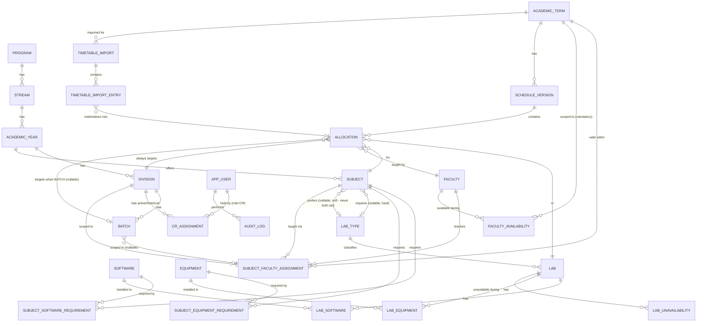

# Database Design

This document finalizes the domain model referenced conceptually in [03-SYSTEM-ARCHITECTURE.md](03-SYSTEM-ARCHITECTURE.md). Every entity below is justified individually — entities are not created just because an earlier list named them. Migration files (Flyway) will be created per-domain starting in Phase 4; this document is the contract those migrations must satisfy.

## Conventions used throughout

- All tables get `id BIGINT` (or UUID — see note in ASSUMPTIONS) surrogate primary keys.
- `created_at` / `updated_at` timestamps on every mutable table.
- Soft status/lifecycle instead of physical deletion wherever the business rules require history (allocations, CR assignments). Pure reference/catalog data (Software, Equipment, LabType) uses a simple `active BOOLEAN` flag rather than a full lifecycle, since there's no approval workflow around catalog edits.
- Every foreign key is indexed (Postgres does not auto-index FK columns); composite indexes for hot lookup paths are called out per-entity below.

---

## 1. Identity & CR Ownership

### `app_user` — **implemented (Phase 3)**
**Why it exists:** Single authentication identity for the three login roles.
**Actual columns** (Flyway `V2__create_app_user.sql`):

| Column | Type | Constraints |
|---|---|---|
| `id` | `BIGINT` (identity) | PK |
| `email` | `VARCHAR(255)` | `NOT NULL`, `UNIQUE` (`uq_app_user_email`) |
| `password_hash` | `VARCHAR(255)` | `NOT NULL` — BCrypt output, never plaintext |
| `role` | `VARCHAR(32)` | `NOT NULL`, `CHECK (role IN ('LAB_ASSISTANT','CR','STUDENT'))` |
| `display_name` | `VARCHAR(255)` | nullable |
| `active` | `BOOLEAN` | `NOT NULL DEFAULT TRUE` |
| `created_at`, `updated_at` | `TIMESTAMPTZ` | `NOT NULL DEFAULT now()` |

**Email case-insensitivity:** handled in application code (`AppUser.normalizeEmail`: trim + lowercase, applied before every read/write), not a PostgreSQL `citext` column — simpler and sufficient at this scale (see docs/09-AUTHORIZATION-RBAC.md).
**Relationships:** one `app_user` (role=CR) → many `cr_assignment` (historical) — `cr_assignment` itself is still planned (Phase 4+), not yet a real table.
**Unique:** `email` (`uq_app_user_email`, enforced by the database — verified in `AuthenticationIT`, a duplicate insert throws `DataIntegrityViolationException`, not just an application-level check).
**Indexes:** the unique constraint's implicit index covers both login lookup (`findByEmail`) and uniqueness; the primary key covers `findById` (used by `JwtAuthenticationFilter` on every request). No separate `role` index was added — not yet queried by role at this phase; add one if/when a "list all CRs" style query is introduced (Phase 4+).
**Soft delete:** `active` flag; deactivation is immediate (re-checked by `JwtAuthenticationFilter` on every request, not just at next login — see docs/09-AUTHORIZATION-RBAC.md).

### `cr_assignment` — **implemented (Phase 4)**, see §3a below for the full column/constraint detail
**Why it exists:** Decouples "who is logged in" from "which division they may act on," and preserves history when a CR is reassigned or a class changes representative.
**Server-side authorization rule (implemented — `CrOwnershipService`):** every CR-scoped request resolves `division_id` by looking up the caller's current `ACTIVE` `cr_assignment` from the JWT-authenticated `userId` — a `divisionId` field in the request body/query is never trusted as authorization. `CrOwnershipService.requireOwnsDivision(userId, divisionId)` throws `FORBIDDEN_DIVISION_ACCESS` if they disagree, `CR_ASSIGNMENT_NOT_FOUND` if the CR has no current active assignment at all, and a plain `FORBIDDEN` if the caller isn't even a CR — see docs/09-AUTHORIZATION-RBAC.md for the full role-vs-ownership distinction.

---

## 2. Academic Hierarchy — **implemented (Phase 4)**

### `program` → `stream` → `academic_year` → `division` → `batch`
**Why they exist:** PART 10/PART 16 explicitly require this to be data-driven — no hardcoded "always 2 batches" or "always 4 years." Each level is a normal table with a FK to its parent, not a single denormalized "class" table, because Lab Assistant CRUD screens (Phase 20) need to manage each level independently (e.g., add a new Division to an existing Year without touching Program/Stream). Codes and names are data, never enums (PART 61) — a future administrator can add a program without a code change.

**Actual columns** (Flyway `V3__create_academic_structure.sql`):

| Table | Key columns | Parent FK | Unique | Notable constraints |
|---|---|---|---|---|
| `program` | `id`, `code`, `name`, `duration_years`, `active` | — | `code` | `duration_years > 0` |
| `stream` | `id`, `program_id`, `code`, `name`, `active` | `program_id` | `(program_id, code)` — **scoped to program, not global** | — |
| `academic_year` | `id`, `stream_id`, `year_number`, `active` | `stream_id` | `(stream_id, year_number)` | `year_number > 0` |
| `division` | `id`, `academic_year_id`, `code`, `strength`, `active` | `academic_year_id` | `(academic_year_id, code)` | `strength > 0` |
| `batch` | `id`, `division_id`, `code`, `strength`, `active` | `division_id` | `(division_id, code)` | `strength > 0` |

**Stream uniqueness decision:** `(program_id, code)`, not a global-unique `code` — "CS" under B.Tech and a hypothetical "CS" under another program are legitimately different rows; a global-unique code would incorrectly forbid that.

**`division`/`batch` don't duplicate `program_id`/`stream_id`:** both are cleanly derivable via the parent chain (`division.academicYear.stream.program`) — storing them again would be redundant FK duplication with no integrity/query benefit large enough to justify it at this scale.

**Ownership:** Lab Assistant manages all five tables (FR-06) via `POST`/`PATCH` — read access is open to any authenticated user. No public hard-delete endpoint exists for any of them; deactivation is always via `active = false` (`PATCH .../{id}` with `active: false`), preserving history for anything that may already be referenced — a reasonable initial design given these are the entities every future scheduling record hangs off of.
**Indexes:** each FK column (`idx_stream_program`, `idx_academic_year_stream`, `idx_division_academic_year`, `idx_batch_division`), plus the unique composites above (Postgres auto-indexes unique constraints).

### `academic_term` — **implemented, independent of the Program/Stream chain**
A **scheduling period** (e.g. "Semester 5, 2026-27") — not to be confused with `academic_year` (the program's *study year*, e.g. "Year 3"). One term applies across the whole institution, not nested under a single program.
**Columns:** `id`, `academic_year_label` (e.g. `"2026-27"`), `term_number`, `display_name`, `start_date`, `end_date`, `status` (`UPCOMING`|`ACTIVE`|`CLOSED`), timestamps.
**Unique:** `(academic_year_label, term_number)`. **Check:** `start_date < end_date`.
**"Current term" decision:** deliberately **not** a global singleton — more than one row may be `ACTIVE` simultaneously (e.g. B.Tech and MBA Tech could run on different term calendars). A naive "exactly one current term" model was rejected per the phase brief's explicit warning; `CrOwnershipService` resolves "current assignment" as the most recent active assignment whose term is `ACTIVE`, which degrades gracefully even with multiple simultaneously-active terms.

### Student Strength — decision (see also ASSUMPTIONS A-13)
**Decision:** class strength for capacity validation (HC-07) is a plain `strength` integer on `batch` (BATCH allocations) and `division` (DIVISION-wide allocations), **required and positive** (`chk_batch_strength_positive`, `chk_division_strength_positive`) — not nullable as an earlier draft of this document had it (corrected in Phase 4: both target types need a real capacity number). **No `Student` entity is created.**
**Reason:** Creating and maintaining hundreds/thousands of individual `Student` rows just to `COUNT(*)` a headcount adds real data-entry burden with zero scheduling benefit — capacity checking only ever needs a single number per batch/division.
**Sum invariant — decision:** the sum of a division's batch strengths is **not** enforced to equal the division's own `strength`. The phase brief explicitly warns against inventing such a rule; a division's `strength` may reasonably be a planning estimate maintained on a different cadence than individual batch rosters.
**Trade-off:** If a future requirement needs per-student features (attendance, individual timetables), a `Student` entity would be added then — tracked in [18-FUTURE-IMPROVEMENTS.md](18-FUTURE-IMPROVEMENTS.md).

---

## 3. Subject, Faculty, and Faculty–Subject Assignment — **implemented (Phase 4)**

### `subject`
**Columns:** `id`, `academic_year_id` (a subject belongs to a specific year/stream/program — e.g. "BDA" is a Year 3 CS subject), `code`, `name`, `active`.
**Unique:** `(academic_year_id, code)`.
**No `SubjectOffering` entity:** considered and rejected — `subject_faculty_assignment` already carries the term-specific "who teaches this, for which division/batch, this term" context a separate offering table would otherwise duplicate (ADR in docs/15-DESIGN-DECISIONS.md).

### `faculty`
**Why it exists:** Domain entity, no login (A-08 in ASSUMPTIONS, ADR-006).
**Columns:** `id`, `employee_code`, `name`, `email` (nullable), `department` (nullable), `active`.
**Unique:** `employee_code`; `email` (nullable-safe — Postgres allows unlimited `NULL`s under a plain `UNIQUE` constraint since `NULL` is never equal to `NULL`, so faculty without a recorded email don't collide with each other, while any *recorded* email still can't be reused).

### `subject_faculty_assignment`
**Design question resolved:** does an assignment connect just `faculty + subject`, or does it need `+ division/batch + academic_term`?
**Decision: the richer model — `faculty + subject + division + academic_term`, with an optional `batch_id`.**
**Reason:** A bare `faculty + subject` link can't answer "which faculty teaches BDA for CS-A this term?" when multiple faculty teach the same subject across different divisions/terms. Without term/division context, the EXTRA-lab workflow (Phase 15) would have no way to auto-suggest "the" faculty for a CR's request.
**Columns:** `id`, `subject_id`, `faculty_id`, `division_id`, `batch_id` (nullable — null means this faculty covers the whole division for this subject/term; set means a batch-specific assignment), `academic_term_id`, `active`.
**Uniqueness (two partial unique indexes, not one plain constraint):** Postgres treats every `NULL` as distinct under an ordinary `UNIQUE` constraint, so a single `UNIQUE(subject_id, division_id, batch_id, academic_term_id)` would silently permit unlimited duplicate *division-level* (`batch_id IS NULL`) rows for the same subject/division/term. Two indexes close that gap:
- `uq_sfa_batch_scoped` on `(subject_id, division_id, batch_id, academic_term_id) WHERE batch_id IS NOT NULL AND active` — at most one active batch-specific assignment.
- `uq_sfa_division_scoped` on `(subject_id, division_id, academic_term_id) WHERE batch_id IS NULL AND active` — at most one active division-level assignment.

Together these guarantee ambiguous "which faculty teaches this" data can never silently exist (PART 14 of the phase brief) — enforced by the database, not just application code.
**Used by:** `FacultyAssignmentResolutionService` — exact batch-level match wins; falls back to the division-level (`batch_id IS NULL`) row if no batch-specific one exists; a `DIVISION`-scoped lookup only ever considers the division-level row.

---

## 3a. CR Assignment — **implemented (Phase 4)**

### `cr_assignment`
Connects an `app_user` (role=CR) to a `division` for a given `academic_term`, preserving history rather than overwriting on reassignment.
**Columns:** `id`, `user_id`, `division_id`, `academic_term_id`, `status` (`ACTIVE`|`ENDED`), `valid_from`, `valid_to` (nullable), `created_by`, `created_at`.
**Role check:** "the referenced user must actually have role CR" cannot be a database `CHECK` constraint across tables in Postgres — enforced in `CrAssignmentService.create()` before every insert, tested in `CrAssignmentServiceTest`.
**Uniqueness (two partial unique indexes, V5 migration):**
- `uq_cr_assignment_division_active` on `(division_id, academic_term_id) WHERE status = 'ACTIVE'` — at most one active CR per division per term.
- `uq_cr_assignment_user_active` on `(user_id, academic_term_id) WHERE status = 'ACTIVE'` — at most one active division per CR per term (keeps authorization unambiguous, PART 17 of the phase brief).

Reassignment (`CrAssignmentService.create` targeting an already-occupied division/user) ends the previous active row(s) and inserts a new one in the same transaction — both preserved as history, never overwritten.

---

## 4. Lab Inventory — **implemented (Phase 5)**

### `lab_type`
**Decision:** configurable table, not an enum.
**Reason:** the phase brief explicitly prefers extensibility ("college requirements may evolve... prefer extensibility unless there is a strong reason otherwise"); a new lab type (e.g. a future "Hardware Lab" or "Seminar Lab") should not require a code change/redeploy.
**Actual columns** (Flyway `V6__create_lab_domain.sql`): `id`, `code`, `name`, `description` (nullable), `active`, timestamps. **Unique:** `code`.

### `lab`
**Actual columns:** `id`, `code`, `name`, `capacity`, `lab_type_id` (FK), `wing`, `floor`, `room_number`, `active`, timestamps.
**Unique:** `code` — the stable, user-facing identifier (e.g. "C-304"); allocation explanations will reference this, never the database id. **Immutable after creation** — `UpdateLabRequest` has no `code` field, deliberately (a stable code matters for future PDF-import cross-referencing — docs/15-DESIGN-DECISIONS.md).
**Check:** `capacity > 0`.
**Location model:** flat `wing`/`floor`/`room_number` strings, not a full campus/building hierarchy — the college is a single building with three wings; a hierarchy would be speculative complexity for a scope that doesn't exist yet (docs/15-DESIGN-DECISIONS.md).
**Capacity semantics:** `capacity` is the hard ceiling used by HC-07 (reject if `required_strength > capacity`); the *scoring* engine's Capacity Fit factor (see [07-ALLOCATION-SCORING.md](07-ALLOCATION-SCORING.md)) separately rewards labs whose capacity is close to (not just ≥) the required strength. HC-07 itself is still Phase 9+ — this phase only guarantees `capacity` is correctly modeled and validated.
**`active = false`** means permanently retired/repurposed — distinct from `lab_unavailability` (temporary, dated).

### `software`, `equipment`
**Actual columns:** `id`, `code`, `name`, `description` (equipment only, nullable), `active`, timestamps. **Unique:** `code`.
**Normalization decision:** `code` is a normalized key (application-uppercased, e.g. `CLOUDERA`), `name` is the separate display label — so "Cloudera"/"cloudera"/"CLOUDERA" can never become three different capability rows (PART 21 of the phase brief). No version column on `software` itself — see `lab_software` below for why.

### `lab_software`, `lab_equipment` — **explicit association entities, not `@ManyToMany`**
**Decision:** both are real entities with their own primary key and metadata columns, not an implicit join table.
**Reason:** `lab_software.installed_version` (nullable) and `lab_equipment.quantity` (required, default 1, `> 0`) are genuine per-installation metadata that a plain `@ManyToMany` join table cannot hold without converting to an explicit entity later anyway — building it as an explicit entity from the start avoids that migration (docs/15-DESIGN-DECISIONS.md).
**Unique:** `(lab_id, software_id)` / `(lab_id, equipment_id)` — prevents a duplicate installation/assignment row; both FKs indexed.
**Quantity decision:** included on `lab_equipment` specifically because the phase brief's own example ("Routers: 10") makes it a real, not speculative, need.

### `lab_unavailability`
**Why it exists:** administrative/temporary lab unavailability (maintenance, repair, a college event) — distinct from `lab.active` (permanent). HC-06 will later combine this with real allocation data (Phase 9+); this table is only the administrative half.
**Actual columns** (Flyway `V7__create_lab_unavailability.sql`): `id`, `lab_id` (FK), `start_date_time`, `end_date_time` (both `TIMESTAMPTZ`), `reason`, `created_by` (FK → `app_user`), `created_at`.
**Granularity — superseding the Phase 1 draft:** this document originally sketched date-level granularity as sufficient ("AC repair" style closures). Phase 5 implemented full datetime (`TIMESTAMPTZ`) granularity instead, per the phase brief's explicit instruction to use proper Java temporal types with clear interval semantics — a same-day partial closure (e.g. "unavailable 2–4pm for inspection") is a realistic enough case that the extra precision costs nothing to include now, so the earlier "date-level is sufficient" framing is superseded, not merely revisited.
**Interval semantics:** half-open `[start, end)`, same as used throughout the project — **Check:** `end_date_time > start_date_time`, enforced by both the database and application validation (`INVALID_UNAVAILABILITY_INTERVAL`).
**No recurrence model:** explicit dated intervals only (PART 16 of the phase brief) — weekly-recurring unavailability is a documented future extension (docs/18-FUTURE-IMPROVEMENTS.md), not built until required.
**No soft-cancel status:** hard-deleted on removal — nothing references a `lab_unavailability` row yet (no allocations exist until Phase 9+), so there is no historical evidence to preserve by keeping a "cancelled" row around (docs/15-DESIGN-DECISIONS.md). Revisit if/when allocation explanations need to say "this lab was scheduled despite an unavailability window that was later cancelled."
**Used by:** HC-06 Lab Availability (Phase 9+, not yet implemented).

---

## 5. Subject Requirements — **implemented (Phase 6)**

The other half of the future Constraint Engine's inputs, complementing Phase 5's lab capabilities. Never mixed onto the same tables: a requirement is never stored on `Lab`, a capability is never stored on `Subject` (docs/03-SYSTEM-ARCHITECTURE.md).

**Requirement scope decision:** subject-level, not a per-term/division "SubjectOffering." Nothing in the existing requirements documented a case where the same subject needs different software in different terms, and introducing that scope now would be exactly the speculative complexity this project's working rules warn against — same reasoning already applied to rejecting a `SubjectOffering` entity in Phase 4.

### `subject_software_requirement`, `subject_equipment_requirement` (Flyway `V8__create_subject_requirements.sql`)
Real association entities `(subject_id, software_id)` / `(subject_id, equipment_id, required_quantity)`. **Absence of any row means no requirement of that kind** — requirements are opt-in, never assumed (PART 17/6 of phase brief; verified with CNS, seeded with zero requirements of any kind).
**No `required` boolean column:** a row's mere existence already means "required" — a boolean that's always `true` on every row would be redundant (PART 4 of the phase brief).
**`required_quantity`** on the equipment requirement (default 1, `CHECK > 0`) mirrors `lab_equipment.quantity` (Phase 5) — future compatibility rule: `availableQuantity(lab, equipment) >= requiredQuantity(subject, equipment)`.
**Multiple-requirement semantics — decision:** when a subject requires more than one software item (or equipment item), **ALL** listed items must be present in a candidate lab (`ALL required`, not `ANY one acceptable`) — matches Phase 5's `LabSpecifications.hasAllSoftware`/`hasAllEquipment` ALL-match filtering semantics exactly, so the future constraint engine's rule and the already-implemented static filter agree by construction.
**Uniqueness:** `(subject_id, software_id)` / `(subject_id, equipment_id)` — prevents `BDA → Cloudera` being recorded twice; both FKs indexed both directions (by subject, and by software/equipment, for a future "which subjects need X" query).
**Version scope:** no version-aware matching (e.g. "Cloudera 7.1+") — software capability is compared by identity/code only. `lab_software.installedVersion` (Phase 5) remains purely informational metadata; version-constrained matching is a documented future enhancement (docs/18-FUTURE-IMPROVEMENTS.md), not built until a real requirement needs it.

### Lab-type requirement — nullable FK columns on `subject`, not a join table
**Columns added to `subject`:** `required_lab_type_id`, `preferred_lab_type_id` (both nullable FKs to `lab_type`).
**Decision:** a subject can require at most **one** lab type, so a join table would only ever hold zero or one row per subject — a nullable column expresses that "optional, single-value" relationship more directly than a table built for a one-to-many shape it never actually uses (same reasoning already applied to `subject.required_lab_type_id` in the Phase 1 draft).
**Required vs. preferred — deliberately distinct, never collapsed:** `requiredLabType` is the HC-10 hard constraint (any other type is invalid); `preferredLabType` is the separate soft scoring signal from docs/07-ALLOCATION-SCORING.md's "Preferred Lab Type" factor. A subject may have neither, or exactly one of the two — **never both at once**.
**Enforcement (defense in depth, the standard pattern throughout this project):** `Subject.setLabTypeRequirement()` rejects both-set in application code (`INVALID_LAB_TYPE_PREFERENCE`, 400) *and* the database CHECK constraint `chk_subject_lab_type_pref` (`required_lab_type_id IS NULL OR preferred_lab_type_id IS NULL`) rejects it independently — verified directly: `AddEquipmentRequirementRequest`/`SetLabTypeRequirementRequest` unit test plus a live Docker check.

### Lifecycle: inactive master data and historical requirements
**New requirements against inactive `Software`/`Equipment`/`LabType` are rejected** (`INACTIVE_SOFTWARE`/`INACTIVE_EQUIPMENT`/`INACTIVE_LAB_TYPE`, 400) — verified live against Docker (deactivated a software row via the Phase 5 API, then confirmed a new requirement referencing it was rejected).
**Existing historical requirement rows are never touched** when their referenced master entity later becomes inactive — no cascading update, no automatic removal. A requirement row simply continues pointing at now-inactive master data; nothing in this phase queries "is my required software still active" against an *existing* requirement (that's a future constraint-engine concern, not a Phase 6 one).
**Requirement removal is a physical delete** (not soft-cancel) — acceptable now because no `Allocation` exists yet to reference a specific requirement snapshot. **Documented future concern, not solved here:** once schedule versions and allocations exist (Phase 9+/18+), changing a requirement after a schedule was generated raises a real historical-explainability question ("Schedule v1 was generated when BDA required Cloudera; the requirement later changed — is v1's explanation still accurate?"). Two candidate future approaches are noted for that later phase to choose between: snapshotting requirements into the schedule version, or persisting explanation evidence directly on `Allocation`. Neither is implemented now — deliberately deferred, not overlooked (see docs/18-FUTURE-IMPROVEMENTS.md).

### `subject_lab_type_requirement`
**Key fields:** `subject_id`, `lab_type_id` (nullable relationship — modeled as a nullable FK column directly on `subject`, `subject.required_lab_type_id`, rather than a join table, since a subject can require **at most one** lab type, unlike software/equipment which can require several). This keeps the "optional, single-value" semantics explicit instead of building a many-to-many table for a strictly zero-or-one relationship.

**Soft-preference companion field:** `subject.preferred_lab_type_id` (nullable FK, independent of `required_lab_type_id`) exists purely for the **Preferred Lab Type** scoring factor in [07-ALLOCATION-SCORING.md](07-ALLOCATION-SCORING.md) — it expresses "nice to have this type" without making it a hard rejection (HC-10 only reads `required_lab_type_id`). Similarly `faculty.preferred_lab_id` (nullable FK) backs the **Faculty Preference** scoring factor. Both are optional, additive columns with no bearing on any hard constraint.

---

## 6. Faculty Availability — **implemented (Phase 7)**

### `faculty_availability` (Flyway `V9__create_faculty_availability.sql`)
**Actual columns:** `id`, `faculty_id` (FK, `NOT NULL`), `academic_term_id` (FK, **`NOT NULL`**), `day_of_week` (`VARCHAR(16)`, `CHECK` against the seven `java.time.DayOfWeek` names), `start_time`/`end_time` (`TIME`), `active` (`BOOLEAN NOT NULL DEFAULT TRUE`), `created_at`, `updated_at`.

**Term-scoping decision — superseding the Phase 1 draft:** this document originally sketched `academic_term_id` as **nullable**, with a null term meaning "applies every term" (docs/ASSUMPTIONS.md A-15). Phase 7 implemented `academic_term_id` as **mandatory** instead, per the phase brief's explicit recommendation ("do not make availability permanently global to a faculty member unless there is a strong reason") — a faculty's weekly availability genuinely can and does change semester to semester (the brief's own example: Semester 5 Monday mornings vs. Semester 6 Monday afternoons), and a nullable "applies forever" row would silently misrepresent that. See ADR-031 in [15-DESIGN-DECISIONS.md](15-DESIGN-DECISIONS.md) and A-32 in [ASSUMPTIONS.md](ASSUMPTIONS.md) (A-15 marked superseded, not deleted).

**Half-open interval `[start_time, end_time)`** — same semantics used throughout the project. **Check:** `end_time > start_time` (`chk_faculty_availability_interval`), mirrored by application validation (`INVALID_AVAILABILITY_INTERVAL`) for a clean typed error before the database is ever touched.

**Overlap protection — Option A (application validation only), not a PostgreSQL exclusion constraint:** overlapping *active* rows for the same `(faculty_id, academic_term_id, day_of_week)` are rejected at write time (`FACULTY_AVAILABILITY_OVERLAP`, 409) by `FacultyAvailabilityService`, never silently merged. A PostgreSQL exclusion constraint (Option B) was evaluated and rejected — see ADR-032 for the full analysis; the short version is that PostgreSQL has no native recurring-weekly range type, and availability data is low-volume and administratively mutated, so a generated-range + `EXCLUDE USING gist` constraint would add real complexity for a guarantee application validation already provides adequately.

**Adjacent rows are permitted** (e.g. `09:00-12:00` and `12:00-15:00` for the same faculty/term/day) — never merged into a single row (keeps administrative intent explicit, ADR-032) but treated as one continuous window during **evaluation only** (`FacultyAvailabilityService.isAvailable`, never mutating the database — see docs/05-SCHEDULING-ENGINE.md).

**Multiple windows per day are supported** — no uniqueness constraint limits a faculty to one row per day; only *overlapping* active rows for the same day are rejected.

**`active` — soft deactivation, not physical delete:** unlike `LabUnavailability` (Phase 5, hard-deleted — a one-off dated event with no ongoing recurrence), a `faculty_availability` row represents an enduring weekly template, so deactivation (`active=false`) was chosen to match this project's dominant historical-entity pattern (Program, Faculty, Software, ...) rather than physically removing it. See ADR-033.

**Missing availability means unavailable, never "available all day":** a faculty with zero active rows for a given `(term, day)` is evaluated as unavailable for every request on that day — the absence of data is never treated as an implicit "always free." This is a deliberate application-layer semantic (`FacultyAvailabilityService.isAvailable` returns `false` on an empty result set), not something the database enforces directly.

**Inactive faculty:** `FacultyAvailabilityService` rejects new availability for an inactive `Faculty` (`FACULTY_INACTIVE`, 400) and `isAvailable(...)` always returns `false` for an inactive faculty regardless of any stored rows — an availability row for a faculty who has since been deactivated is never treated as making them schedulable.

**Indexes:** `(faculty_id)`, `(academic_term_id)`, and a partial composite `(faculty_id, academic_term_id, day_of_week) WHERE active` — the hot lookup path for both overlap validation and availability evaluation.

**Future extension (documented, not built):** a `faculty_unavailability_exception` table (single-date overrides, e.g. "faculty on leave March 5") would layer on top of this recurring weekly pattern without changing this table's shape — noted in [18-FUTURE-IMPROVEMENTS.md](18-FUTURE-IMPROVEMENTS.md).
**Used by:** HC-03 Faculty Availability (docs/06-CONSTRAINTS.md) — the source data now exists; the actual `FacultyAvailabilityConstraint` class remains Phase 9+.

---

## 7. Scheduling Core: Term, Version, Allocation — **implemented (Phase 8)**

### `academic_term` — **implemented (Phase 4)**
**Key fields:** `id`, `academic_year_label`, `term_number`, `display_name`, `start_date`, `end_date`, `status`. See §2 above.

### `schedule_version` (Flyway `V10__create_schedule_version_and_allocation.sql`)
**Actual columns:** `id`, `academic_term_id` (FK, `NOT NULL`), `version_number` (`INT NOT NULL`, `CHECK > 0`), `status` (`DRAFT`|`PUBLISHED`|`SUPERSEDED`), `reason` (nullable — required for v2+ by application validation, `ScheduleVersionService.createDraft`, not a database rule, since a version's first release genuinely needs no justification), `created_by`/`created_at`, `published_by`/`published_at` (both nullable until published).
**Rule — at most one `PUBLISHED` version per term:** enforced two ways, not just documented as a convention (defense in depth, this project's standing pattern): `ScheduleVersionService.publish()` actively transitions the term's previous `PUBLISHED` version to `SUPERSEDED` in the same call, **and** a partial unique index (`uq_schedule_version_one_published_per_term ON schedule_version (academic_term_id) WHERE status = 'PUBLISHED'`) makes the invalid state structurally impossible even if application code ever had a bug — verified directly: a second `PUBLISHED` row for the same term was rejected by Postgres in a live transactional test (docs/11-TESTING-STRATEGY.md).
**Uniqueness:** `(academic_term_id, version_number)` — `uq_schedule_version_term_number`.
**Lifecycle — strictly forward, never backward:** `DRAFT → PUBLISHED → SUPERSEDED`; `SUPERSEDED → DRAFT` is never allowed (a superseded version is permanent history) — enforced by `ScheduleVersion.publish()`/`.supersede()`'s transition guards (`INVALID_SCHEDULE_VERSION_TRANSITION`, 409).
**No end-user API in this phase** (PART 33 of the Phase 8 brief) — `ScheduleVersionService` exists and is exercised by tests and the dev seeder only; a management API arrives with Phase 18 (schedule-version history UI) / Phase 19 (PDF import approval).

### `allocation` — the central entity (Flyway `V10__create_schedule_version_and_allocation.sql`)

| Field | Type | Notes |
|---|---|---|
| `id` | PK | |
| `allocation_type` | `REGULAR` \| `EXTRA` | |
| `target_type` | `BATCH` \| `DIVISION` | see ADR-005 |
| `division_id` | FK → division, **always set** | every allocation belongs to a division regardless of target_type |
| `batch_id` | FK → batch, **nullable** | set only when `target_type = BATCH`; must belong to `division_id` |
| `subject_id` | FK → subject | |
| `faculty_id` | FK → faculty | |
| `lab_id` | FK → lab | |
| `allocation_date` | DATE | a session is always within a single local college day — no overnight sessions |
| `start_time`, `end_time` | TIME | half-open interval `[start_time, end_time)`, same convention as everywhere else in this project |
| `status` | `APPROVED` \| `PUBLISHED` \| `CANCELLED` | Deliberately small — see [03-SYSTEM-ARCHITECTURE.md §5](03-SYSTEM-ARCHITECTURE.md) for why `DRAFT`/`PENDING_REVIEW`/`CONFLICT`/`REJECTED` were removed from `Allocation` and live only on `TimetableImportEntry`/`TimetableImport` instead — an `Allocation` row is only ever created once it's already known valid. `AllocationStatus.blocksScheduling()` (`APPROVED`/`PUBLISHED` → `true`, `CANCELLED` → `false`) is the single, centralized definition of "active" every repository query uses — no query independently invents its own active-status list. |
| `schedule_version_id` | FK, **not null** | see rule below — every `Allocation` is stamped with a version at creation time |
| `created_by`, `created_at` | | |
| `approved_by`, `approved_at` | nullable | REGULAR only — the Lab Assistant who approved the source import; unpopulated until Phase 19 builds the approval flow that sets it |
| `cancelled_by`, `cancelled_at`, `cancellation_reason` | nullable | set only on cancellation, via `Allocation.cancel()` |

**No separate `academic_term_id` column** — deliberately, since the term is always derivable via `allocation.getScheduleVersion().getAcademicTerm()`; a redundant FK here could theoretically disagree with the version it's attached to, for no integrity or query benefit large enough to justify carrying it (same "don't duplicate a derivable FK" principle already applied to `division`/`batch` not repeating `program_id`/`stream_id`, §2 above).

**`schedule_version_id` rule:** a `REGULAR` allocation is created against the term's current `DRAFT` `schedule_version` and becomes visible (`status → PUBLISHED`) only when the Lab Assistant explicitly publishes that version. An `EXTRA` allocation is created **directly against the term's currently *published* version** and is immediately stamped `status = PUBLISHED` in the same transaction — it does not wait for the next official version cut (this resolves ASSUMPTIONS A-11: extra labs overlay the live published version as soon as they're validly booked, since waiting would defeat the point of fast makeup-lab scheduling). `schedule_version_id` is therefore never null on any persisted `Allocation` row. **Not implemented yet:** the actual creation flow that decides which version to attach to (Phase 15/19) — Phase 8 only makes `schedule_version_id NOT NULL` and ready to receive it.

**Invariants:**
1. `target_type = BATCH → batch_id IS NOT NULL AND batch.division_id = allocation.division_id`
2. `target_type = DIVISION → batch_id IS NULL`

**Enforcement — decision: both application validation AND a database CHECK constraint (implemented as designed, with one correction from the Phase 1 draft).**
- **Application validation** is enforced by `Allocation`'s two static factory methods, `forBatch(...)`/`forDivision(...)` — the *only* way to construct an instance, specifically so the invariant can never be bypassed by construction. This corrects the Phase 1 draft's assumption of "Bean Validation / service-layer check" — there is no `AllocationService.create()` yet for Bean Validation to attach to (Phase 8 deliberately has no creation API, PART 31), so the guarantee lives on the entity itself instead, ready for whichever service calls it in Phase 15/19.
- **Database CHECK constraint** (`chk_allocation_target_invariant`) is the second, non-bypassable line of defense — verified directly: a `BATCH`-typed row with a null `batch_id` was rejected by Postgres in a live transactional test.
- The `batch.division_id = allocation.division_id` cross-table consistency check cannot be a simple CHECK constraint (Postgres CHECK constraints can't query another table); `Allocation.forBatch` enforces it by comparing the already-loaded `Batch.getDivision().getId()` against the target division — no extra query needed, since the caller must supply a loaded `Batch` entity, not a bare id.

**Indexes (critical for future constraint-checking performance, Phase 9):**
- `(lab_id, allocation_date)` — HC-01/HC-06.
- `(faculty_id, allocation_date)` — HC-02/HC-03.
- `(batch_id, allocation_date)` — HC-04.
- `(division_id, allocation_date)` — HC-05 (returns both `DIVISION`-wide and `BATCH` rows for that division, with no join, since `division_id` is always set regardless of `target_type` — see `AllocationRepository` javadoc).
- All four are partial indexes `WHERE status IN ('APPROVED', 'PUBLISHED')` since only active allocations occupy resources — this keeps the hot conflict-checking indexes small and fast even as cancelled/rejected history accumulates.
- `(schedule_version_id)`, `(status)`, `(subject_id)` — general-purpose lookups (e.g. "all allocations in this version," "all cancelled allocations"), not on the per-candidate hot path.

**Concurrency — explicitly deferred, not solved here (ADR-010, Phase 16):** no PostgreSQL exclusion constraint exists yet over `(lab_id, allocation_date, time-range)` — Phase 8 only adds the lookup indexes above; the final FCFS-safe concurrency mechanism (row locking vs. an exclusion constraint via `btree_gist`) remains Phase 16's decision, backed by the concurrent-request integration test in docs/11-TESTING-STRATEGY.md.

### The `LocalDate`/`LocalTime` ↔ `Instant` bridge (`SchedulingTimeMapper`)

`allocation.allocation_date`/`start_time`/`end_time` are `DATE`/`TIME` (`LocalDate`/`LocalTime`) — matching `faculty_availability`'s type shape exactly, so `TimeIntervalUtils` is directly reusable for HC-01/02/04/05 with no conversion. `lab_unavailability.start_date_time`/`end_date_time` (Phase 5) are `TIMESTAMPTZ`/`Instant` — a genuine type boundary HC-06 (Phase 9) will need to cross. Rather than leaving that conversion to be solved independently inside `LabAvailabilityConstraint` (and risking three slightly-different ad hoc conversions if other future code needs the same bridge), Phase 8 introduces `SchedulingTimeMapper` (`com.college.laballocation.scheduling`) as the single, central `LocalDate + LocalTime + configured ZoneId → Instant` conversion, backed by a configurable `app.college.time-zone` property (env `COLLEGE_TIME_ZONE`, default `Asia/Kolkata`) rather than a hardcoded manual UTC offset — see ADR-037.

---

## 8. PDF Import

### `timetable_import`
**Key fields:** `id`, `academic_term_id`, `uploaded_by`, `uploaded_at`, `file_reference`, `status` (`UPLOADED`|`PARSED`|`UNDER_REVIEW`|`APPROVED`|`REJECTED`).

### `timetable_import_entry`
**Why separate from `allocation`:** PDF extraction is unreliable (ADR-007); an entry must be correctable and re-validated before it ever becomes a real, conflict-checked `allocation` row.
**Key fields:** `id`, `timetable_import_id`, `raw_extracted_data` (the as-extracted values: subject text, faculty text, lab text, time text — kept for audit/debugging of the parser), `corrected_subject_id`, `corrected_faculty_id`, `corrected_lab_id`, `corrected_division_id`, `corrected_batch_id`, `corrected_date`, `corrected_start_time`, `corrected_end_time`, `validation_status` (`PENDING`|`VALID`|`CONFLICT`), `conflict_details` (nullable text/JSON explaining why), `resulting_allocation_id` (nullable FK, set once approved and materialized into `allocation`).

---

## 9. Audit

### `audit_log`
**Key fields:** `id`, `actor_user_id`, `actor_role`, `action` (enum/string, e.g. `EXTRA_LAB_CREATED`), `resource_type`, `resource_id`, `metadata` (JSONB — the one deliberate use of a flexible column in this schema, since audit metadata shape genuinely varies per action type and is never queried relationally, only displayed), `created_at`.
**Append-only:** no UPDATE/DELETE path exists in application code (ADR — see design decisions).
**Indexes:** `(resource_type, resource_id)` for "history of this allocation," `(actor_user_id)` for "this CR's activity."

---

## 10. Entity-Relationship Diagram

This matches §3/§5 of [03-SYSTEM-ARCHITECTURE.md](03-SYSTEM-ARCHITECTURE.md) exactly; that document's ER diagram will be updated to reference this one rather than duplicating it.

**Implementation status against this diagram (Phase 8):** `PROGRAM`, `STREAM`, `ACADEMIC_YEAR`, `DIVISION`, `BATCH`, `ACADEMIC_TERM`, `SUBJECT`, `FACULTY`, `SUBJECT_FACULTY_ASSIGNMENT`, `CR_ASSIGNMENT`, `APP_USER` (Phase 4); `LAB_TYPE`, `LAB`, `SOFTWARE`, `EQUIPMENT`, `LAB_SOFTWARE`, `LAB_EQUIPMENT`, `LAB_UNAVAILABILITY` (Phase 5); `SUBJECT_SOFTWARE_REQUIREMENT`, `SUBJECT_EQUIPMENT_REQUIREMENT`, `subject.required_lab_type_id`/`preferred_lab_type_id` (Phase 6); `FACULTY_AVAILABILITY` (Phase 7); `SCHEDULE_VERSION`, `ALLOCATION` (Phase 8) are all real, migrated tables/columns. Everything else in this diagram (`TIMETABLE_IMPORT*`, `AUDIT_LOG`) remains the Phase 1 plan, not yet implemented — Phase 19+ per the roadmap. No `SchedulingConstraint` reads or writes `ALLOCATION` yet (Phase 9+); Phase 8 only establishes the table and its query infrastructure.

---

## 11. Cross-reference to ASSUMPTIONS

New assumptions from this phase (A-13 Student strength model, A-14 primary key type, A-15 term-scoping of faculty availability, A-16 lab_unavailability date granularity) are recorded in [ASSUMPTIONS.md](ASSUMPTIONS.md).
